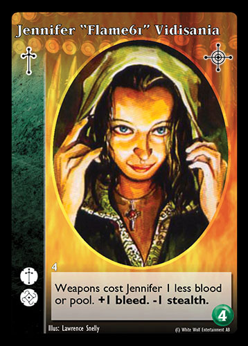
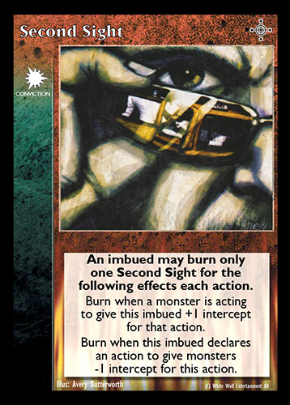

# [**1. Wstęp**](https://www.vekn.net/rulebook/1-introduction)

*Wampir: Wiekuisty konflikt (Vampire: The Eternal Struggle) to gra karciana z modyfikowalnymi taliami, w której czterech
lub pięciu graczy wciela się w role prastarych wampirów, zwanych
Matuzalemami. Rozgrywka toczy się w mrocznym, alternatywnym odbiciu naszej
rzeczywistości, zwanym Światem Mroku. Matuzalemowie są uważani
przez młodsze wampiry za zwyczajne legendy. Młodsze wampiry uważają, że
działają we własnym interesie, nawet wtedy, gdy są wykorzystywane przez jednego z Matuzalemów
do podkopania wpływów drugiego. Na całym świecie Matuzalemowie
manipulują swoimi podwładnymi udaremniając plany innych
Matuzalemów i robią to od tak dawna, jak sięga pamięć. Te
wiekuiste konflikty bywają utajone i subtelne, ale bywają także jawne i
widowiskowe.*

Niniejszy zestaw zasad zawiera wszystkie zasady potrzebne do zagrania w grę Wampir: Wiekuisty konflikt.
W celu ułatwienia nauki zasad, część z nich prezentujemy w sekcjach „Zasady zaawansowane”. Mimo że stanowią one nieodłączną część gry, zalecamy nowym graczom ich pominięcie w trakcie nauki podstaw gry.

## **Cel gry**

Twoim celem jest zdobycie jak największej liczby punktów zwycięstwa poprzez zniszczenie
wpływów posiadanych przez rywalizujących Matuzalemów. Osiągasz ten cel wykorzystując
swoje wpływy do przejęcia kontroli nad młodszymi wampirami i wykorzystujesz je,
aby wykonywały akcje zmniejszające wpływy rywalizujących Matuzalemów. Wpływy
reprezentują znaczniki puli, stanowiące główną walutę gry. Matuzalem,
któremu skończy się pula, jest eliminowany z rozgrywki. W miarę
eliminowania Matuzalemów z rozgrywki pozostali Matuzalemowie zdobywają punkty zwycięstwa –
zwycięża Matuzalem z największą liczbą punktów zwycięstwa pod koniec
rozgrywki.

**Karty:** Talia każdego Matuzalema składa się z dwóch składowych: krypty oraz
biblioteki.

Karty w Twojej krypcie reprezentują wampiry, które masz nadzieję kontrolować – ich
awersy zawierają owalne wizerunki, a rewersy są w kolorze bursztynowego marmuru.

Karty w Twojej bibliotece reprezentują szerszy Świat Mroku i
pozwalają Tobie oraz Twoim podwładnym działać w tym świecie – ich awersy zawierają
kwadratowe ilustracje, a rewersy są w kolorze zielonego marmuru.

Krypta i biblioteka tworzą dwa niezależne stosy, z których karty krypty i karty biblioteki 
są dobierane podczas rozgrywki (patrz Przygotowanie rozgrywki, Dobieranie kart i Faza wpływów). Dobierane karty biblioteki
są przenoszone na rękę ich właściciela. Dobierane karty krypty są przenoszone do rejonu niekontrolowanego właściciela (patrz Obszar gry).

> **BUDOWA TALII**\
> Każdy Matuzalem musi mieć co najmniej 12 kart w swojej krypcie oraz
> od 60 do 90 kart w swojej bibliotece. Maksymalna liczba kart
> w krypcie Matuzalema nie jest ograniczona.\
> Matuzalem może umieścić dowolną liczbę egzemplarzy danej karty w
> bibliotece oraz w krypcie, z zachowaniem powyższych limitów.\
> Każdy wampir należy do pewnej **grupy**, *group*, określanej przez numer
> znajdujący się nad lewym górnym rogiem okienka tekstowego. Krypta Matuzalema
> możne być zbudowana tylko z wykorzystaniem wampirów z pojedynczej grupy lub z dwóch
> kolejnych grup.

**Znaczniki:** Znaczniki, *counters*, stanowią nieodłączną część rozgrywki. Każdy z Matuzalemów
potrzebuje około 40 znaczników: 30 do swojej początkowej puli oraz dodatkowych znaczników,
które stanowią bank krwi. Znaczniki wykorzystywane do oznaczania puli, krwi
i życia nie różnią się, ale nazywane są inaczej, w zależności o tego, czy znajdują się w Twojej
puli, na wampirach (krew) lub na sprzymierzeńcach (życie). Na przykład znacznik
przeniesiony z puli na wampira staje się krwią. Podobnie
krew ukradziona z wampira przez sprzymierzeńca staje się życiem. Kiedy palisz,
płacisz lub wydajesz 1 znacznik krwi lub puli, to zwracasz go do banku krwi.
Zyskując 1 znacznik krwi lub puli, otrzymujesz go z banku
krwi. Krew dodawana na wampira dodawana jest z banku krwi.
Znacznikami krwi i puli mogą być dowolne poręczne przedmioty, jak na przykład monety,
szklane paciorki, czy kamyki. Wykorzystanie pojedynczych przedmiotów do oznaczania zmieniających się
liczb (np. kości) nie jest zalecane ze względu na częstą potrzebę
przenoszenia znaczników z miejsca na miejsce.

**Przewaga:** Przewaga, *Edge*, symbolizuje, że dzięki swoim podwładnym tymczasowo
górujesz nad pozostałymi Matuzalemami. Wybierz coś,
co będzie reprezentowało Przewagę. Może to być dowolny mały, wyróżniający się przedmiot, na przykład
figurka, błyskotka lub rękawiczka.

> **KOLEJNOŚĆ TURY**\
> \
> Tury następują zgodnie z ruchem wskazówek zegara wokół obszaru gry, zaczynając od pierwszego Matuzalema. Tura każdego Matuzalema składa się z następujących kolejno po sobie pięciu faz:
> 1. **Faza odkręcania**\
> Odkręć, *unlock*, wszystkie swoje karty i rozpatrz wszystkie aktywne **spory**, *contests*. Jeśli masz **Przewagę**, to możesz zyskać 1 znacznik puli z **banku krwi**, *blood bank*.
> 2. **Faza mistrza**\
> Wykonaj **akcje fazy mistrza**, *master phase actions*, reprezentujące Twój bezpośredni wpływ w Świecie Mroku.
> 3. **Faza podwładnych**\
> Jest to zazwyczaj najdłuższa część Twojej tury, ponieważ Twoi podwładni, *minions*, wykonują wiele różnych **akcji**, *actions*, wykorzystując umiejętności lub karty. Akcje mogą zostać **zablokowane**, *blocked*, co może doprowadzić do walki.
> 4. **Faza wpływów**\
> W fazie wpływów, *influence phase*, przejmujesz kontrolę nad wampirami w swoim **rejonie niekontrolowanym**, *uncontrolled region*, korzystając ze swojej puli oraz **przelewów**, *transfers*.
> 5. **Faza odrzucania**\
> Wykorzystaj **akcję fazy odrzucania**, *discard phase action*, aby **odrzucić**, *discard*, kartę ze swojej ręki oraz dobrać inną lub (Zasady zaawansowane) aby zagrać **kartę wydarzenia**, *event card*.
> 
> Każdą z tych faz opisano szczegółowo w dalszej części niniejszego zbioru zasad (patrz Szczegółowa kolejność tury, str. 17).

# [**2. Rodzaje kart**](https://www.vekn.net/rulebook/2-card-types)

## **KARTY KRYPTY**

Każda karta krypty, *crypt card*, obejmuje zestaw poniższych elementów określających wampira.

**Nazwa:** Każda karta krypty jest unikatowa, dlatego jednocześnie w grze może znajdować się tylko jeden egzemplarz 
każdej z nich.

> **ZASADY ZAAWANSOWANE**\
> Inny Matuzalem może prowadzić spór o kontrolę nad wampirem (patrz [**Sporne karty**](https://www.vekn.net/rulebook/4-detailed-turn-sequence#Contested-cards)), 
> co oznacza, że Matuzalemowie ci walczą o kontrolę nad nim.

**Potencjał krwi:** Liczba w czerwonym kółku w prawym dolnym
rogu karty oznacza potencjał, *capacity*, wampira.

Liczba ta odzwierciedla wiele rzeczy: względny wiek wampira,
liczbę znaczników puli, jaką Matuzalem musi zainwestować w wampira, aby przejąć
nad nim kontrolę, a także jego maksymalne możliwości w zakresie gojenia
ran oraz zagrywania kart (zagrywanie niektórych kart kosztuje krew). O wampirze z
większym potencjałem mówi się, że jest starszy, a wampir o mniejszym
potencjale jest młodszy. Krew na wampirze nie może przekroczyć jego
potencjału – jeśli jakiś efekt powoduje położenie liczby znaczników krwi przekraczającej potencjał wampira,
to nadmiar jest zawsze natychmiast przenoszony do banku krwi.

Znaczniki krwi leżące na niekontrolowanym wampirze
stanowią liczbę znaczników puli, która została w niego zainwestowana. Jeśli
w fazie wpływów liczba ta jest równa potencjałowi krwi wampira lub go
przekracza, to możesz tego wampira ujawnić i umieścić w rejonie gotowych.
Zachowuje znaczniki puli wykorzystane jako wpływy na tę kartę,
służące jako krew wampira, a wszelkie znaczniki krwi przekraczające potencjał wampira spływają
do banku krwi (patrz [**Faza wpływów**](https://www.vekn.net/rulebook/4-detailed-turn-sequence#influence-phase)).

**Klan:** Każdy wampir należy do klanu, *clan*, oznaczonego symbolem znajdującym się
w górnej części paska atrybutów (marmurkowy pasek znajdujący się po lewej stronie
karty).

Na stronie [**Skrót informacji**](https://www.vekn.net/rulebook/9-quick-reference)
można znaleźć listę symboli klanów. Zagranie niektórych kart biblioteki wymaga wampira
należącego do określonego klanu wampirów, a inne karty biblioteki mogą mieć wpływ
tylko na wampiry z określonego klanu.

**Dyscypliny:** Są to nadprzyrodzone moce, którymi władają wampiry.
Dyscypliny, *Disciplines*, posiadane przez wampira oznacza grupa
symboli znajdujących się w dolnej części paska atrybutów.

Dyscypliny wampirów określają które karty biblioteki mogą one zagrywać.
Jeśli karta biblioteki wymaga Dyscypliny (oznaczonej symbolem Dyscypliny na
pasku atrybutów karty biblioteki), to tylko wampiry posiadające daną
Dyscyplinę mogą ją zagrać.

Każdy symbol Dyscypliny wampira ma kształt
kwadratu lub rombu. Symbol Dyscypliny w kwadracie oznacza, że
wampir posiada podstawowy poziom tej Dyscypliny i może użyć wyłącznie
efektu podstawowego (zwykły tekst) określonego na karcie wymagającej tej
Dyscypliny.

Symbol Dyscypliny w rombie oznacza, że wampir posiada jej
wyższy poziom i w związku z tym może użyć efektu podstawowego (zwykły
tekst) lub efektu wyższego (pogrubiony tekst) określonego na tej karcie (ale nie obu).

Niektóre karty biblioteki posiadają wiele symboli Dyscyplin na pasku atrybutów
(patrz [**Wymagania dla zagrywania kart**](https://www.vekn.net/rulebook#requirements-for-playing-cards)).

> **BUDOWA TALII**\
> **Grupa:** Każdy wampir należy do pewnej grupy, *group*, określanej przez
> numer znajdujący się nad lewym górnym rogiem okienka tekstowego. Krypta Matuzalema
> może być utworzona tylko z wykorzystaniem wampirów z jednej grupy lub z dwóch
> kolejnych grup. Nie ogranicza to jednak Matuzalema przed kradzieżą
> wampirów z innych grup w trakcie rozgrywki.

> **ZASADY ZAAWANSOWANE**\
> **Zaawansowana:** Karta zaawansowana, *advanced*, to rodzaj karty wampira umieszczany w
> krypcie. Karta zaawansowana wygląda tak, jak zwykła karta krypty, z tą różnicą,
> że pod symbolem klanu znajduje się symbol Zaawansowana. Karta zaawansowana
> jest kartą wampira pod każdym względem, więc można na nią wpływać w
> standardowy sposób (patrz [**Zaawansowana**](https://www.vekn.net/rulebook/4-detailed-turn-sequence#advanced)).

**Pole tekstowe:** Miejsce, w którym określana jest sekta wampira (w tym przypadku Camarilla),
tytuł, umiejętności specjalne oraz inne atrybuty.

**Symbol dodatku:** Symbol ten oznacza dodatek, w którym
pojawiła się ta karta krypty, nie mający wpływu na rozgrywkę.

**Ilustracja:** Określa artystę, który stworzył grafikę dla tej
karty.

**Prawa autorskie:** Określa prawa autorskie do gry, należące do firmy
Paradox Interactive AB (publ).

**Uwaga:** Niektóre zaawansowane dodatki zawierają inne rodzaje kart krypty – aby je poznać, zajrzyj tutaj: [**Załącznik**](https://www.vekn.net/rulebook/appendix-imbued-rules).

## **KARTY BIBLIOTEKI**

### **Rodzaje kart**

Istnieją dwa główne rodzaje kart biblioteki, *library cards*:

**Karty mistrza:** Karty mistrza, *master cards*, zagrywane są przez Matuzalemów. Karty mistrza
nie posiadają żadnego symbolu w górnej części paska atrybutów, podczas gdy na innych kartach
w tym miejscu znajduje się symbol określający do jakiego rodzaju karty te należą.

**Karty podwładnych:** Karty podwładnych, *minion cards*, zagrywane są przez podwładnych (wampiry i
sprzymierzeńców) kontrolowanych przez Matuzalema.

> **ZASADY ZAAWANSOWANE**\
> Karty wydarzeń: Karty wydarzeń, *event cards*, są wprowadzane do gry w fazie odrzucania,
> odzwierciedlając wydarzenia wpływające na cały Świat Mroku
> (patrz [**Karta wydarzenia**](https://www.vekn.net/rulebook/4-detailed-turn-sequence#event-card)).

### **Zagranie karty**

Karta jest zagrywana poprzez zadeklarowanie jej efektu, pokazanie karty i przeniesienie
jej po rozpatrzeniu ze swojej ręki na stos spalonych. Niekiedy karta mówi, że należy ją wprowadzić
do gry, w takim przypadku należy zadeklarować jej efekty i umieścić tę kartę
po rozpatrzeniu w obszarze gry.
Niektórych kart, takich jak karty akcji, nie rozpatruje się od razu. W tym przypadku tymczasowo znajdują się one poza grą – od momentu ich zagrania, do momentu ich rozpatrzenia.

> **ZASADY ZAAWANSOWANE**\
> Niektóre efekty mogą anulować kartę „podczas jej zagrywania”. Efekty te, podobnie
> jak [**efekty przebudzenia**](https://www.vekn.net/rulebook/8-glossaries#wake), *wake effects*,
> stanowią wyłączne efekty dozwolone w okresie czasu „podczas zagrywania”
> innej karty. Nawet dobieranie za karty następuje po tym okresie
> czasu.

### **Dobieranie kart**

Za każdym razem gdy zagrywasz kartę z ręki, dobierasz, *draw*, następną ze swojej
biblioteki, aby ją zastąpić (chyba że tekst karty mówi inaczej). Jeśli Twoja biblioteka
jest pusta, to nie dobierasz, aby uzupełnić rękę, ale dalej
kontynuujesz rozgrywkę. Liczba kart w Twojej ręce powinna zawsze odpowiadać
Twojemu rozmiarowi ręki (karty za które dobierasz później redukują rozmiar ręki na
czas trwania efektu). Początkowy domyślny rozmiar ręki to siedem
kart na ręce. Za każdym razem gdy efekt zmienia Twój rozmiar ręki, dodaje lub
usuwa karty z ręki, od razu odrzucasz lub dobierasz do
swojego rozmiaru ręki.

### **Wymagania dla zagrywania kart**

Każda karta biblioteki posiada symbole na pasku atrybutów (marmurkowym pasku po
lewej stronie) oznaczające rodzaj karty (za wyjątkiem kart mistrza), klan, (ewentualne)
Dyscypliny wymagane do zagrania karty oraz (ewentualny) koszt
zagrania tej karty.

Niektóre karty uwzględniają inne wymagania (np. potencjał lub tytuł),
określone w tekstach kart. Tylko podwładny spełniający wymagania określone
na karcie podwładnego może ją zagrać, i tylko Matuzalem kontrolujący
gotowego podwładnego spełniającego wymagania karty mistrza może taką kartę zagrać.

Efekty wymienione na karcie mogą wymagać jednej z wymienionych Dyscyplin,
inne efekty mogą wymagać innej z wymienionych Dyscyplin, a niektóre
efekty mogą wymagać, aby wampir posiadał wiele Dyscyplin. Dla każdego
efektu wskazane są symbole wymaganych Dyscyplin.

Liczba w czerwonej kropli oznacza koszt w krwi (liczbę znaczników krwi,
które musi spalić wampir). Tylko wampir z wystarczającą liczbą znaczników krwi może zagrać
kartę z kosztem w krwi. Liczba w białym rombie z czaszką
oznacza koszt z puli (liczbę znaczników puli, które musi spalić Matuzalem). Tylko
Matuzalem z wystarczającą liczbą znaczników puli może zagrać kartę z kosztem z puli.

Koszty mogą być opłacane tylko z zasobów własnych Matuzalema lub podwładnego. Dla przykładu 
niektóre karty i efekty posiadają alternatywny koszt, taki jak spalenie Przewagi lub odrzucenie karty – 
Matuzalem musi kontrolować Przewagę, aby spalić ją w celu zapłacenia kosztu lub odrzucić jedną ze swoich kart z ręki.
Podwładni kontrolowani przez Matuzalema mają dostęp do zasobów tego Matuzalema umożliwiający płacenie kosztów, np.
Podwładny może odrzucić kartę z ręki kontrolującego go Matuzalema.

Opcjonalne redukcje kosztów można wykorzystywać podczas zagrywania karty (w celu zagrania karty) lub po rozpatrzeniu (można poczekać aż wiadomo będzie, czy akcja jest udana). Jeśli karta zostanie anulowana, efekt ten nie jest wykorzystywany.

### **Wybieranie kart jako celu**

Jeśli karta jest zagrywana na inną kartę lub wybiera inną kartę jako cel, to
karta wybierana jako cel musi się znajdować w grze (musi być kontrolowana). Wampiry w rejonie
letargu domyślnie stanowią odpowiednie cele, ale wampiry w rejonie
niekontrolowanym oraz sporne karty już nie.

>**ZASADY ZAAWANSOWANE**\
> **Określanie kolejności**\
> Jeśli dwóch lub więcej Matuzalemów chce zagrać kartę lub efekt, to działający
> Matuzalem zagrywa je pierwszy. Działający Matuzalem na każdym etapie zawsze
> ma możliwość (inaczej „impuls”) zagrania następnej karty lub następnego efektu. Oznacza to, że po zagraniu
> jednego efektu, może zagrać następny i kolejny. Kiedy skończy,
> impuls przechodzi do następnego Matuzalema w następującej kolejności: 
> podczas walki lub akcji ukierunkowanej na jednego Matuzalema – najpierw do broniącego się Matuzalema, 
> podczas akcji ukierunkowanej na zestaw Matuzalemów – do tych Matuzalemów, w kolejności zgodnej z ruchem wskazówek zegara, 
> podczas akcji nieukierunkowanej – najpierw do ofiary, potem do drapieżcy. 
> Następnie każdy inny Matuzalem w kolejności zgodnej z ruchem wskazówek zegara otrzymuje impuls, do momentu aż wszyscy spasują.
> Zwróć uwagę, że za każdym razem gdy dowolny Matuzalem użyje karty lub efektu, działający Matuzalem
> ponownie otrzymuje impuls z powrotem.

### **Karty mistrza**

Karty mistrza, *master cards*, to karty, które zagrywasz jako Matuzalem. Istnieją
dwie kategorie kart mistrza: karty mistrza zwykłe i pozaturowe, *out-of-turn*.

Zwykłe karty mistrza zagrywasz podczas swojej fazy mistrza jako akcje fazy
mistrza. Na początku każdej ze swoich faz mistrza otrzymujesz jedną akcję
fazy mistrza, którą możesz wykorzystać do zagrania zwykłej karty mistrza.
Pozaturowe karty mistrza można zagrywać tylko w turach innych
Matuzalemów. Zagrywając pozaturową kartę mistrza wykorzystujesz akcję
fazy mistrza ze swojej następnej fazy mistrza, zagrywając kartę od razu, zamiast
czekać do swojej najbliższej fazy mistrza.

Karta mistrza w grze jest kontrolowana przez Matuzalema, który ją zagrał,
nawet jeśli jest ona zagrana na kartę kontrolowaną przez innego Matuzalema.

Powszechne rodzaje kart mistrza to:

**Miejsca:** Karta miejsca, *location*, reprezentuje miejsce (np. budynek,
miasto lub określone miejsce zgromadzeń) kontrolowane przez Matuzalema lub
jego podwładnych. Karta miejsca zostaje w grze i można z niej korzystać
wielokrotnie, nawet w turze, w której została zagrana. Niektóre efekty podczas rozgrywki mogą je
spalić.

**Drobnostka:** Niektóre z kart mistrza określane są jako drobnostki, *trifle*. Matuzalem,
któremu uda się zagrać drobnostkę, otrzymuje dodatkową akcję
fazy mistrza. W przypadku pozaturowych drobnostek Matuzalem uzyskuje akcję fazy mistrza
w swojej następnej fazie mistrza. Matuzalem może zyskać tylko jedną akcję fazy
mistrza z drobnostek w danej fazie mistrza. Wszelkie kolejne drobnostki są traktowane
jak zwykłe karty mistrza.

**Inne karty mistrza:** Wszelkie karty mistrza, których nie objaśniono tutaj, mają
efekty zgodne z ich opisami.

> **ZASADY ZAAWANSOWANE**\
> **Dyscypliny:** Karta Dyscypliny, *Discipline*, zagrywana jest na kontrolowanego wampira,
> zapewniając mu dodatkowy poziom Dyscypliny, czyli zapewniając
> wampirowi podstawowy poziom nowej Dyscypliny lub zwiększając poziom
> Dyscypliny z podstawowego na wyższy. Większość z nich zwiększa również
> o 1 potencjał wampira (w tym przypadku wskazuje na to „+1”
> w czerwonym kółku w prawym dolnym rogu karty) oprócz
> zapewnienia Dyscypliny, jednak dodatkowa krew nie jest automatycznie
> uzyskiwana, aby uzupełnić nowo uzyskany potencjał.\
> \
> **Trofeum:** Trofeum, *trophy*, można wprowadzić do gry z wykorzystaniem akcji fazy mistrza
> (można też je uzyskiwane zgodnie z opisem zawartym w cechach: [**Czerwona Lista**](https://www.vekn.net/rulebook/7-legacy-sets#red-list)).
> Do czasu przeniesienia na wampira trofeum nie ma żadnego efektu. Po przeniesieniu na
> wampira trofeum jest kontrolowane przez kontrolującego wampira, na którym
> się ono znajduje, i nie może zostać przyznane ponownie.\
> \
> **Pozaturowa:** Pozaturową kartę mistrza, *out-of-turn master card*, możesz zagrać w dowolnym
> odpowiednim momencie podczas tury innego Matuzalema. Zagranie takie liczy się
> do przydzielonej liczby akcji fazy mistrza, które otrzymasz w swojej następnej
> fazie mistrza, nawet jeśli ta pozaturowa karta mistrza zostanie anulowana
> (patrz [**Faza mistrza**](https://www.vekn.net/rulebook/4-detailed-turn-sequence#master-phase)).\
> \
> Niezależnie od liczby standardowo posiadanych akcji fazy mistrza,
> nie możesz zagrać drugiej pozaturowej karty mistrza do swojej następnej
> fazy mistrza. Pozaturowej karty mistrza nie możesz zagrać w swojej własnej
> turze.

### **Karty podwładnych**

Karty podwładnych, *minion cards*, to karty zagrywane przez wampiry i sprzymierzeńców
(zbiorczo nazywane „podwładnymi”).

> **ZASADY ZAAWANSOWANE**\
> Karta podwładnego w grze jest kontrolowana przez Matuzalema kontrolującego podwładnego,
> na którym się ona znajduje. Jeśli karta podwładnego znajduje się w grze, ale nie na innej
> kontrolowanej karcie, to jest ona kontrolowana przez Matuzalema, który
> ją zagrał.

W wielu przypadkach na karcie podwładnego znajduje się symbol Dyscypliny, symbol
klanu i/lub koszt w krwi. W tych przypadkach karta ta może być zagrana tylko
przez wampira spełniającego te wymagania.

Poniżej znajduje się lista powszechnych rodzajów kart podwładnych. W niektórych przypadkach
karty podwładnych należą do wielu rodzajów.

**Karty akcji:** Gotowy odkręcony (patrz [**Ważne terminy w grze**](https://www.vekn.net/rulebook/3-playing-the-game#important-terms-of-the-game))
podwładny może zagrać kartę akcji, *action card*, aby wykonać akcję inną niż
akcje domyślne. Podczas akcji można zagrać tylko jedną kartę akcji.
Kart akcji nie można wykorzystywać do modyfikowania innych akcji.

**Karty modyfikatorów akcji:** Działający podwładny może zagrywać te karty, aby
zmodyfikować swoją akcję w dowolnym momencie przed rozpatrzeniem akcji. Podwładny
nie może zagrać takiej samej karty modyfikatora akcji, *action modifier card*, więcej niż raz podczas jednej
akcji (nawet korzystając z innego poziomu Dyscypliny).

Niektóre karty modyfikatorów akcji są zagrywane przez podwładnych „innych niż działający
podwładny”. Karty te mogą zagrywać tylko podwładni kontrolowani przez tego samego
Matuzalema.

**Karty sprzymierzeńców:** Karty te, *ally cards*, są wprowadzane do gry ze swoim początkowym życiem
z banku krwi i pozostają niezależne od działającego podwładnego.

**Karty sprzętu:** Karty te, *equipment cards*, są wprowadzane do gry na działającego podwładnego.
Karty sprzętu są palone, gdy palony jest podwładny, na którym się one znajdują
(zazwyczaj zwany „posiadaczem”).

> **ZASADY ZAAWANSOWANE**\
> \
> **Sprzymierzeńcy**\
> \
> Sprzymierzeńcy, *allies*, to podwładni niebędący wampirami, których możesz kontrolować jako
> Matuzalem. Niektórzy sprzymierzeńcy posiadają zdolność zagrywania określonych kart „jak
> wampir”. W tych przypadkach sprzymierzeniec jest traktowany jako wampir dla celów wszystkich
> efektów generowanych przez zagranie karty, wraz z efektami dotyczącymi czasu trwania
> (np. „na czas trwania walki”). Życie sprzymierzeńca stanowi
> jego krew (dla celów płacenia kosztów, itp.). Wszelka krew, którą zyskuje lub traci jako 
> wampir oznacza zysk lub stratę życia dla tego sprzymierzeńca. Dla celów
> takiej karty sprzymierzeniec ma potencjał równy 1 jeśli karta ta
> wymaga starszego wampira lub wampira o określonym potencjale. Jeśli
> sprzymierzeniec zyskuje życie przekraczające jego potencjał, to nie spływa ono do banku krwi,
> a jeśli efekt zadaje temu sprzymierzeńcowi poważne obrażenia, to standardowo
> pali on życie. Jeśli jednak efekt wysyła sprzymierzeńca w letarg,
> to jest on zamiast tego palony. Sprzymierzeniec jest traktowany jako wampir tylko
> dla celów efektu generowanego przez zagranie tej karty. Przede wszystkim,
> sprzymierzeniec nie jest traktowany jako wampir dla celów efektów wynikających z karty
> znajdującej się w grze (np. efektów typu „wampir z tą kartą”).

**Karty sług:** Karty te, *retainer cards*, są wprowadzane do gry na działającego podwładnego,
ze swoim początkowym życiem z banku krwi. Karty sług są palone
gdy palony jest ostatni znacznik ich życia lub gdy palony jest podwładny, na którego zostały one zagrane
(zazwyczaj nazywany „zatrudniającym”).

**Karty akcji politycznych:** Kartę akcji politycznej, *political action card*, można zagrać, aby
zwołać referendum jako akcję lub spalić podczas
referendum [**aby zyskać głos**](https://www.vekn.net/rulebook/4-detailed-turn-sequence#political-action-cards), *gain a vote*.
Karty akcji politycznych mogą zagrywać tylko wampiry.
Karty akcji politycznych można rozpoznać po symbolu akcji politycznej.

**Karty walki:** Karty te, *combat cards*, są zagrywane przez podwładnych podczas walki
(patrz [**Walka**](https://www.vekn.net/rulebook/4-detailed-turn-sequence#combat)).

**Karty reakcji:** Gotowy odkręcony podwładny może zagrać kartę reakcji, *reaction card*, w
odpowiedzi na akcję podjętą przez podwładnego kontrolowanego przez innego
Matuzalema.

Podwładny nie może zagrać tej samej karty reakcji więcej niż raz podczas
jednej akcji (nawet korzystając z innego poziomu Dyscypliny). Karta reakcji
nie przekręca podwładnego, który ją zagrywa.

> **ZASADY ZAAWANSOWANE**\
> \
> **Karty odruchów**\
> \
> Podwładny może zagrać kartę odruchu, *reflex card*, aby anulować określony rodzaj karty
> zagranej na niego w momencie jej zagrania (patrz [**Zagranie karty**](https://www.vekn.net/rulebook#playing-a-card)).

> **ZASADY ZAAWANSOWANE**\
> \
> **Karty wydarzeń**\
> \
> Karty wydarzeń, *event cards*, są zagrywane, aby odzwierciedlić wydarzenia wpływające na
> cały Świat Mroku. Raz na fazę odrzucania Matuzalem może wykorzystać
> akcję fazy odrzucania, aby wprowadzić do gry kartę wydarzenia. Każde wydarzenie może
> być zagrane tylko raz w ciągu rozgrywki. Kartę wydarzenia kontroluje
> Matuzalem, który je zagrał.

# [**3. Rozgrywka**](https://www.vekn.net/rulebook/3-playing-the-game)

## **PRZYGOTOWANIE ROZGRYWKI**

**Kolejność gry**

Usadzenie można ustalić dowolną metodą wybraną przez
Matuzalemów. Ustalcie losowo który z Matuzalemów będzie wykonywał akcje jako pierwszy. Dla
każdego Matuzalema Matuzalem po lewej stronie jest ofiarą, *prey* (1). Jest to
Matuzalem, którego masz nadzieję wyeliminować z rozgrywki. Matuzalem po Twojej
prawej stronie to Twój drapieżca, *predator* (2). Jest to Matuzalem, który ma nadzieję wyeliminować
z rozgrywki Ciebie. Po wyeliminowaniu Twojej ofiary następny Matuzalem po lewej
stronie staje się Twoją nową ofiarą.

**Bank krwi**

Każdy Matuzalem bierze 30 znaczników krwi, tworząc swoją początkową pulę, *pool* (3).
Pozostałe znaczniki krwi umieszczane są na środku, tworząc
bank krwi, *blood bank* (4). Znaczniki krwi w banku krwi nigdy się nie
kończą – w razie potrzeby należy wykorzystać dodatkowe znaczniki, monety, kamyczki, itp.

**Przewaga**

Przewaga, *Edge* (5), jest na początku rozgrywki niekontrolowana i również umieszcza się
ją na środku.

**Obszar gry**

Obszar przed każdym z Matuzalemów dzieli się na dwa rejony:
rejon niekontrolowany, *uncontrolled region* (6), i rejon kontrolowany, *controlled region* (7). Rejon
kontrolowany dzieli się ponadto na dwa rejony: rejon gotowych, *ready region* (8) i
rejon letargu, *torpor region* (9). Rejon letargu to specjalny obszar dla zranionych wampirów. W miarę
postępów rozgrywki będziesz zyskiwać kontrolę nad niektórymi ze swoich podwładnych, przenosząc
ich odkrytych do rejonu gotowych.

Aby rozpocząć, rozdziel swoje karty krypty, *crypt cards* (10) od swoich kart biblioteki, *library cards* (11).
Przetasuj obie talie i daj do przełożenia swojemu drapieżcy. Umieść obie talie
przed sobą. Dobierz siedem kart z wierzchu biblioteki, tworząc swoją rękę, *hand* (12)
i wyłóż zakryte cztery karty z wierzchu krypty do swojego rejonu
niekontrolowanego (6). W karty na swojej ręce i w swoim rejonie
niekontrolowanym możesz spojrzeć w dowolnym momencie rozgrywki.

## **WAŻNE TERMINY W GRZE**

**Spalenie:** Palona karta, *burned*, umieszczana jest na stosie spalonych
(kart odrzuconych) właściciela. Każdy Matuzalem może w dowolnym momencie uzyskać wgląd w stos
spalonych. Palony znacznik jest zwracany do banku krwi.
W niektórych przypadkach instrukcja mówi, aby usunąć kartę z gry. Niektóre
karty i efekty mogą wyciągać karty ze stosu spalonych, jednak kart usuniętych
z gry nie można w ten sposób wyciągać i nie można mieć na nie żadnego wpływu.
Kiedy karta jest palona lub usuwana z gry, wszelkie znajdujące się na niej znaczniki oraz
inne karty są palone.

**Kontrola:** Wampiry wprowadzane do gry przez Matuzalema są kontrolowane, *controlled*, przez
tego Matuzalema.

Karta mistrza w grze jest kontrolowana przez Matuzalema, który ją zagrał,
nawet jeśli została ona zagrana na kartę kontrolowaną przez innego Matuzalema.

Karta podwładnego w grze jest kontrolowana przez Matuzalema kontrolującego podwładnego,
na którym się ona znajduje. Jeśli karta podwładnego znajduje się w grze i nie na innej kontrolowanej
karcie, to jest ona kontrolowana przez Matuzalema, który ją zagrał.

Kontrola może ulegać zmianie w związku z efektami podczas rozgrywki – zastosowania tych
efektów są wyraźnie określane.

**Przekręcanie i odkręcanie:** W trakcie rozgrywki obracasz karty na bok pod kątem 90º
w celu ich przekręcenia, *lock*, co oznacza, że karty zostały wykorzystane w jakimś
określonym celu lub dla uzyskania jakiegoś efektu. Odkręcenie, *unlock*, karty przywraca ją do jej
początkowej pozycji, co oznacza, że karta ta została zresetowana i będzie można
później ponownie ją przekręcić. Tylko odkręceni podwładni mogą wykonywać akcje lub
blokować akcje innych podwładnych.

**Zasady dotyczące posiadania kart:** Karty, z którymi zaczynasz rozgrywkę są określane
jako „posiadane”. Twoje karty mogą stać się kontrolowane przez innych Matuzalemów,
ale w żadnym przypadku nie wchodzą w ich posiadanie. Po zakończeniu rozgrywki posiadane
przez Ciebie karty są Ci zwracane. W przypadku Twojej eliminacji przed zakończeniem
rozgrywki, wszelkie posiadane przez Ciebie karty kontrolowane przez innych Matuzalemów zostają
w grze do momentu ich standardowego spalenia.

**Złota zasada dla kart:** W przypadku sprzeczności kart z zasadami,
karty mają znaczenie decydujące.

### **Wzorce sformułowań**

**„Podczas X zrób Y”:** Wzorzec „podczas X zrób Y”, *during X do Y*, jest wykorzystywany przez wiele
kart. W przypadku tego wzorca Y można wykonać tylko raz na każdy X korzystając z
tej karty. Możesz na przykład przesunąć jeden znacznik krwi ze swojego wampira do swojej
puli dzięki karcie Żywiciel, *Vessel*, można tylko raz na fazę odkręcania.

**„Przekręć X, aby zrobić Y”:** Efekty te, *lock X to do Y*, wymagają wykorzystania odkręconego podwładnego i
nie mogą ich wykorzystywać przekręceni podwładni.

**„Wyszukaj”:** Niektóre efekty nakazują Ci wyszukanie, *search*, z biblioteki lub krypty. Nie musisz
deklarować jakiej karty szukasz, a szukanie może
zakończyć się nieznalezieniem karty. W przypadku wyszukiwania z biblioteki lub krypty
należy ją następnie przetasować.

> **ZASADY ZAAWANSOWANE**\
> \
> **„Anuluj kartę”:** Karta anulowana, *cancelled*, nie ma efektu, ale nadal jest
> traktowana jako zagrana.\
> \
> Jeśli karta akcji zostanie anulowana, to podwładny nie przekręca się (nie
> płaci za kartę akcji) i może ponownie zagrać tę samą kartę akcji.\
> \
> Jeśli anulowana zostanie karta niebędącej kartą akcji, to jej koszt jest płacony standardowo.\
> \
> Jeśli anulowana zostanie karta walki wykorzystana jako cios, to podwładny,
> który ją zagrał musi wybrać cios, który może wynikać z innej karty
> ciosu.

# [**4. Szczegółowa kolejność tury**](https://www.vekn.net/rulebook/4-detailed-turn-sequence)

Poszczególne fazy opisano szczegółowo w kolejnych działach.

## **1. FAZA ODKRĘCANIA**

Zaczynasz swoją turę od fazy odkręcania. Na początku swojej
fazy odkręcania należy odkręcić wszystkie swoje karty. Wszelkie karty oraz efekty
wymagające zrobienia czegoś lub umożliwiające Ci zrobienie czegoś w swojej fazie odkręcania
wywierają efekt dopiero po tym, jak odkręcisz swoje karty. Możesz wybrać kolejność
następowania tych efektów. Oprócz efektów generowanych przez karty,
podczas fazy odkręcania rozpatrywane są również inne efekty:

Jeśli posiadasz Przewagę, to możesz zyskać 1 znacznik puli z banku krwi.

> **ZASADY ZAAWANSOWANE**\
> \
> Niektóre karty posiadają symbol opcji spalenia.\
> \
> Symbol ten oznacza, że Matuzalem, który nie kontroluje podwładnego spełniającego
> wymagania tej karty lub będącego legalnym celem, może ją odrzucić w fazie odkręcania
> DOWOLNEGO Matuzalema i dobrać za nią kartę.\
> \
> Każdy Matuzalem może w każdej fazie odkręcania odrzucić w ten sposób kartę tylko raz.\

> **ZASADY ZAAWANSOWANE**\
> \
> **Sporne karty**\
> \
> Niektóre karty w rozgrywce reprezentują unikatowe zasoby, takie jak
> określone miejsca, sprzęt lub ludzi. Karty te określane
> są w tekstach kart jako „unikatowe”, *unique*. Ponadto, wszystkie karty
> krypty reprezentują unikatowych podwładnych. Wprowadzenie do gry więcej niż jednej unikatowej
> karty o tej samej nazwie oznacza, że kontrola nad tą kartą staje się
> przedmiotem sporu. Na czas prowadzenia sporu wszystkie
> sporne karty są zakrywane i znajdują się poza grą. Jeśli kolejna
> unikatowa karta o tej samej nazwie zostanie wprowadzona do gry, to
> od razu staje się ona przedmiotem sporu i również jest zakrywana.\
> \
> Koszt prowadzenia sporu o kartę to 1 znacznik puli i opłacasz go w każdej
> swojej fazie odkręcania. Zamiast płacenia kosztu prowadzenia sporu o kartę
> możesz podjąć decyzję o odstąpieniu karty. Odstępowana karta ta jest palona. Wszelkie karty
> i znaczniki znajdujące się na odstępowanej karcie są również palone. Jeśli wszystkie inne
> karty stanowiące przedmiot sporu o Twoją unikatową kartę zostały odstąpione, to karta ta jest
> odkręcana i odkrywana w Twojej najbliższej fazie odkręcania, kończąc
> spór.

> **BUDOWA TALII**\
> \
> **UWAGA:** Uważaj z wkładaniem duplikatów takich samych unikatowych kart
> do swojej talii. Nie możesz kontrolować jednocześnie więcej niż jednego egzemplarza
> unikatowej karty i nie możesz dobrowolnie prowadzić sporu o karty ze sobą (jeśli jakiś
> efekt powodowałby rozpoczęcie sporu z samym sobą, to
> wprowadzany egzemplarz unikatowej karty jest po prostu palony). Z kolei
> drugi egzemplarz może się przydać w razie spalenia pierwszego z nich.

> **ZASADY ZAAWANSOWANE**\
> \
> **Sporne tytuły**\
> \
> Niektóre tytuły są unikatowe. Na przykład każde miasto może mieć tylko
> jednego księcia lub barona (patrz [**Sekty wampirów**](https://www.vekn.net/rulebook/6-vampire-sects)).
> Jeśli więcej niż jeden wampir w grze rości sobie prawo do tego samego unikatowego tytułu,
> to tytuł ten stanowi przedmiot sporu, *contested title*. W czasie prowadzenia sporu o tytuł wampiry
> zaangażowane w spór traktuje się jakby nie miały tytułu, ale
> nadal są kontrolowane i mogą normalnie działać oraz blokować.\
> \
> Koszt prowadzenia sporu o tytuł to 1 znacznik krwi i jest on opłacany przez wampira
> w każdej jego fazie odkręcania. Zamiast płacenia kosztu prowadzenia
> sporu o tytuł wampir może podjęć decyzję o odstąpieniu tytułu (lub może
> być zmuszony do odstąpienia, jeśli nie będzie mieć krwi, aby go opłacić). Tylko gotowe
> wampiry mogą prowadzić spór o tytuły. Wampiry w letargu muszą odstąpić w
> fazie odkręcania.\
> \
> Jeśli wszystkie inne wampiry prowadzące spór z Twoim wampirem
> odstąpią od sporu, to Twój wampir uzyska tytuł w Twojej najbliższej
> fazie odkręcania, kończąc spór.\
> \
> Wampir odstępujący tytuł od tego momentu nie posiada tytułu i
> w pozostałej części rozgrywki traci korzyści płynące z tego tytułu.
>

## **2. FAZA MISTRZA**

W swojej fazie mistrza otrzymujesz akcje fazy mistrza. Akcja
fazy mistrza reprezentuje Twoje osobiste działanie podczas tury jako
Matuzalema.

Domyślnie otrzymujesz tylko jedną akcję fazy mistrza, jednak niektóre karty mogą
zmieniać ich liczbę. Akcję fazy mistrza możesz wykorzystać, aby zagrać kartę
mistrza, ale niektóre karty mogą umożliwiać inne sposoby wykorzystania akcji
fazy mistrza.

Jeśli w Twojej fazie mistrza zachodzą inne efekty, to możesz wybrać kolejność
następowania tych efektów oraz wykonywania swoich akcji fazy mistrza.

Wykorzystanie akcji fazy mistrza nie jest obowiązkowe. Nie możesz jednak
zachować akcji fazy mistrza na później. Akcje fazy mistrza
niewykorzystane w tej fazie przepadają.

> **ZASADY ZAAWANSOWANE**\
> \
> Akcję fazy mistrza możesz wykorzystać, aby naznaczyć podwładnego z Czerwonej Listy
> (patrz [**Czerwona Lista**](https://www.vekn.net/rulebook/7-legacy-sets#red-list)).\
> \
> Po zagraniu pozaturowej karty mistrza liczącej się do tej fazy mistrza
> (nawet jeśli została ona anulowana) otrzymujesz jedną akcję fazy mistrza mniej
> niż standardowo (patrz [Karty mistrza](https://www.vekn.net/rulebook/2-card-types#master-cards)).

## **3. FAZA PODWŁADNYCH**

Większość aktywności podczas rozgrywki przypada na fazę podwładnych, *minion phase*. W swojej fazie podwładnych
możesz wykonywać akcje swoimi podwładnymi. Wykonywać akcje mogą
tylko gotowi odkręceni podwładni, a podjęcie akcji przekręca
działającego podwładnego. Gotowi odkręceni podwładni, kontrolowani przez innych Matuzalemów,
mogą próbować zablokować Twoją akcję, a zablokowanie przekręca blokującego podwładnego
(patrz [**Rozpatrzenie wszelkich prób zablokowania**](https://www.vekn.net/rulebook#resolve-any-block-attempts)).
Akcja jest udana tylko jeśli nie zostanie ona zablokowana. Każdą akcję należy
rozpatrzyć (jako udaną lub zablokowaną) przed wykonaniem kolejnej akcji.

Jeśli podwładny zdoła się odkręcić (dzięki karcie lub efektowi) w tej
samej fazie, to może on wykonać następną akcję.

Niektóre akcje są przymusowe. Wszystkie akcje przymusowe należy wykonać
przed wykonaniem jakichkolwiek akcji nieprzymusowych. Jeśli dwóch lub więcej z Twoich podwładnych ma do wykonania
akcje przymusowe, to mogą one być wykonane w wybranej przez Ciebie kolejności. Podwładny,
który ma do podjęcia akcję przymusową, nie może wykonać żadnej innej akcji. Na
przykład gotowy wampir bez krwi musi polować – jest to akcja przymusowa.

Jeśli podwładny ma do wykonania dwie lub więcej różnych akcji przymusowych, lub jedną akcję przymusową, której nie może podjąć,
to jest „uwięziony” i nie może wykonać żadnej akcji (nie przeszkadza to
jednak w wykonywaniu akcji przez innych podwładnych).

**Rodzaje akcji**

> **AKCJE UKIERUNKOWANE I NIEUKIERUNKOWANE**\
> \
> Poniższe akcje mogą być ukierunkowane, *directed*, lub nieukierunkowane, *undirected*,
> w zależności od ich celów (patrz [**Kto może próbować zablokować**](https://www.vekn.net/rulebook#who-may-attempt-to-block)).\
> \
> Dla ułatwienia, w przypadku kart opisujących akcję, która jest zazwyczaj
> ukierunkowana na innego Matuzalema, tekst karty zazwyczaj zawiera
> symbol (D) jako przypomnienie, że akcja ta jest zazwyczaj ukierunkowana, *directed*. Jeśli
> nie, to jest ona traktowana jako nieukierunkowana.

> **KRYCIE I PRZECHWYTYWANIE**\
> \
> O tym, czy akcja będzie udana, decydują dwie rzeczy:\
> \
> **Krycie**, *stealth*, reprezentuje środki podejmowane przez działających podwładnych w
> celu przeprowadzenia ich przedsięwzięć bez wykrycia przez wrogów.\
> \
> **Przechwytywanie**, *intercept*, reprezentuje starania blokujących podwładnych, mające na celu wykrycie i
> uniemożliwienie prób uniknięcia ich przez działających podwładnych.

Akcję może wykonać każdy gotowy odkręcony podwładny, którego kontrolujesz. Procedurę
rozpatrywania akcji opisano w kolejnych
działach. Zwróć uwagę, że karty modyfikatorów akcji oraz karty reakcji można zagrywać odpowiednio
w dowolnym momencie w ramach tego procesu, z uwzględnieniem poniższych
ograniczeń dotyczących dodawania krycia i przechwytywania. Ten sam podwładny nie może zagrać
takiego samego modyfikatora akcji ani takiej samej karty reakcji więcej niż raz podczas jednej
akcji (patrz [**Karty podwładnych**](https://www.vekn.net/rulebook/2-card-types#minion-cards)).
Wszystkie karty należy rozpatrywać zgodnie z tymi samymi strukturami określania kolejności dla wszystkich efektów
(patrz [**Określanie kolejności**](https://www.vekn.net/rulebook/2-card-types#sequencing)).

Gotowy wampir może na ogół wykonać dwie podstawowe akcje, które
nie wymagają zagrania kart akcji: drenowanie lub polowanie, a gotowy
sprzymierzeniec może wykonać tylko jedną akcję podstawową, która nie wymaga zagrania
kart akcji: drenowanie.

Zamiast wykonywania akcji podstawowej, gotowy podwładny może zagrać
kartę akcji, aby wykonać akcję określoną na karcie. Niektóre karty
akcji są ulepszonymi wersjami podstawowych akcji drenowania lub polowania, a
inne stanowią oryginalne rodzaje akcji.

Gotowi podwładni mogą również wykorzystywać akcje, aby wprowadzać do gry różne
rodzaje stałych zasobów. Są to trzy bardzo podobne akcje, chociaż
karty wprowadzane przez nie do gry już takie nie są:

> **Sprzęt:** np. komputery, broń i egzotyczne artefakty. Karta
> sprzętu, *equipment*, jest wprowadzana do gry poprzez akcję ekwipowania. Sprzęt
> można również przenosić między podwładnymi poprzez wykonanie akcji.\
> \
> **Słudzy:**, towarzysze, pomocnicy i zwierzęta działające na
> rzecz podwładnego. Sługa, *retainer* wprowadzany jest do gry poprzez
> akcję zatrudnienia sługi. Sług nie można przenosić pomiędzy
> podwładnymi.\
> \
> **Sprzymierzeńcy:** podwładni niebędący wampirami, np. magowie, wilkołaki i
> zwykli śmiertelnicy. Sprzymierzeniec, *ally*, wprowadzany jest do gry poprzez akcję pozyskania
> sprzymierzeńca.

Podwładny nie może wykonać akcji z wykorzystaniem takiej samej karty akcji więcej niż raz na turę, nawet jeśli się odkręci.
Podwładny nie może wykonać akcji dzięki temu samemu egzemplarzowi karty znajdującej się w grze (w tym
wynikającej z tekstu karty samego podwładnego) więcej niż raz na turę, nawet jeśli się
odkręci.

### **Drenowanie**

*Wykonanie akcji drenowania reprezentuje dążenia Twojego podwładnego do
osłabienia władzy i puli Matuzalema będącego celem. Drenowanie można
zobrazować jako płacenie łapówek, zmianę dokumentacji bankowej, rozsiewanie plotek,
itp.*

Drenować, *bleed*, można przy użyciu karty akcji lub z wykorzystaniem podstawowej akcji
drenowania. Podczas akcji drenowania karta modyfikatora akcji nie może być zagrana, aby zwiększyć drenowanie, 
jeśli wartość drenowania została już zwiększona przez inną kartę modyfikatora akcji (chyba że któraś
z nich nie liczy się do tego limitu). O zasadzie tej przypomina
w tekstach kart określenie „(limit)”.

- **Kto może drenować:** Każdy gotowy podwładny. Podwładny nie może wykonać więcej niż
jednej akcji drenowania na turę, nawet jeśli się odkręci.
- **Domyślny koszt:** Brak.
- **Domyślny cel:** Twoja ofiara. Akcja ukierunkowana. Niektóre karty i
efekty mogą Ci jednak umożliwiać lub wymuszać na Tobie drenowanie Matuzalema innego niż Twoja
ofiara. W żadnym wypadku nie można drenować siebie.
- **Domyślne krycie:** 0 krycia.
- **Efekt:** Jeśli akcja ta będzie udana, to Matuzalem będący celem pali
liczbę znaczników puli równą wartości drenowania. Domyślna wartość drenowania
dla wszystkich wampirów to 1. Jeśli akcja ta będzie udana i wartość drenowania wynosi 1 lub
więcej, to drenowanie jest udane, a kontrolujący działającego
podwładnego otrzymuje Przewagę, przejmując ją jeśli posiada ją inny Matuzalem.

 

### **Polowanie**

*Polowanie to sposób wampira na zaspokojenie jego żądzy krwi.*

Polować, *hunt*, można z użyciem karty akcji lub z wykorzystaniem podstawowej akcji polowania.

- **Kto może polować:** Każdy gotowy wampir. Zwróć uwagę, że polowanie jest akcją przymusową
dla gotowego odkręconego wampira bez krwi. W Twojej fazie
podwładnych żaden z Twoich podwładnych nie może wykonać żadnych akcji nieprzymusowych jeśli którykolwiek
z Twoich gotowych odkręconych wampirów ma jeszcze do wykonania akcję polowania. Jeśli
przymusowe akcje polowania muszą wykonać dwa z Twoich wampirów, to mogą
one być wykonane w dowolnej wybranej przez Ciebie kolejności.
- **Domyślny koszt:** Brak.
- **Domyślny cel:** Brak. Akcja nieukierunkowana.
- **Domyślne krycie:** +1 krycia.
- **Efekt:** Działający wampir zyskuje liczbę znaczników krwi z
banku krwi równą wartości polowania. Domyślna wartość polowania
dla wszystkich wampirów to 1. Jeśli prowadzi to do przekroczenia przez liczbę znaczników krwi wampira jego
potencjału krwi, to (jak zawsze) nadmiar od razu jest zwracany
do banku krwi.

### **Ekwipowanie**

- **Kto może się ekwipować:** Każdy gotowy podwładny.
- **Koszt:** Zgodnie z treścią karty sprzętu w przypadku zagrywania tej karty ze
swojej ręki. Bez kosztu w przypadku ekwipowania, *equip*, w sprzęt od innego kontrolowanego przez siebie podwładnego.
- **Domyślny cel:** Brak. Akcja nieukierunkowana.
- **Domyślne krycie:** +1 krycia.
- **Efekt przy ekwipowaniu ze swojej ręki:** Karty sprzętu to karty
akcji zapewniające podwładnym specjalne zdolności. Jeśli akcja ekwipowania w
kartę sprzętu ze swojej ręki jest udana, to ta karta sprzętu kładziona
jest na działającego podwładnego. Liczba kart sprzętu posiadanych przez
podwładnego nie jest ograniczona.
- **Efekt przy ekwipowaniu od innego kontrolowanego przez siebie podwładnego:** Ekwipowanie w
kartę sprzętu posiadaną aktualnie przez innego z Twoich podwładnych. Podczas
jednej akcji można przejąć od podwładnego więcej niż jedną kartę sprzętu,
ale sprzęt do przeniesienia musisz zadeklarować podczas deklarowania
 akcji. Jeśli akcja ta będzie nieudana, to sprzęt zostaje na swoim
miejscu.

> **ZASADY ZAAWANSOWANE**\
> \
> Jeśli ekwipowanie w sprzęt wymaga Dyscypliny i sprzęt ten jest
> wprowadzany do gry w inny sposób niż poprzez akcję ekwipowania, zastosuj podstawową
> wersję tego sprzętu.

### **Zatrudnienie sługi**

- **Kto może zatrudnić sługę:** Każdy gotowy podwładny.
- **Koszt:** Zgodnie z treścią danej karty sługi.
- **Domyślny cel:** Brak. Akcja nieukierunkowana.
- **Domyślne krycie:** +1 krycia.
- **Efekt:** Słudzy to karty akcji zapewniające podwładnym specjalne
zdolności. Jeśli akcja ta, *employ a retainer*, będzie udana, to sługę kładzie się na
działającego podwładnego. Liczba sług posiadanych przez podwładnego nie jest
ograniczona. W przeciwieństwie do sprzętu, sług nie można przenosić. Sługa
wprowadzany do gry otrzymuje znaczniki krwi z banku
krwi, reprezentujące jego życie (określone na karcie sługi). Sługa
tracący ostatni znacznik życia jest palony.

> **ZASADY ZAAWANSOWANE**
> 
> Jeśli zatrudnienie sługi wymaga Dyscypliny i sługa ten jest
> wprowadzany do gry w inny sposób niż poprzez akcję zatrudnienia, zastosuj podstawową
> wersję tego sługi.

### **Pozyskanie sprzymierzeńca**

- **Kto może pozyskać sprzymierzeńca:** Każdy gotowy sługa.
- **Koszt:** Zgodnie z treścią danej karty sprzymierzeńca.
- **Domyślny cel:** Brak. Akcja nieukierunkowana.
- **Domyślne krycie:** +1 krycia.
- **Efekt:** Sprzymierzeńcy to karty akcji, które stają się podwładnymi,
zdolnymi do działania i blokowania niezależnie od pozyskującego
ich podwładnego. Jeśli akcja ta, *recruit an ally*, będzie udana, to sprzymierzeńca kładziesz w swoim
rejonie gotowych, ale nie może w tej samej turze działać. Sprzymierzeniec wprowadzany
do gry otrzymuje znaczniki krwi z banku krwi, reprezentujące
jego życie (określone na karcie sprzymierzeńca). Sprzymierzeniec tracący ostatni
znacznik życia jest palony.

> **ZASADY ZAAWANSOWANE**\
> \
> Zwróć uwagę, że sprzymierzeńcy wprowadzeni do gry w inny sposób mogą działać w
> tej samej turze. Jeśli pozyskanie sprzymierzeńca wymaga Dyscypliny i
> jest on wprowadzany do gry w inny sposób niż poprzez akcję pozyskania, zastosuj
> podstawową wersję tego sprzymierzeńca.

### **Akcja polityczna**

- **Kto może podjąć akcję polityczną:** Każdy gotowy wampir. Pojedynczy wampir
nie może wykonać więcej niż jednej akcji politycznej, *political action*, na turę.
- **Koszt:** Zgodnie z treścią danej karty akcji politycznej.
- **Domyślny cel:** Brak. Akcja nieukierunkowana.
- **Domyślne krycie:** +1 krycia.
- **Efekt:** Akcja polityczna to akcja wykorzystywana do zwołania
referendum. Jeśli akcja ta będzie udana, to wybierane są warunki referendum,
oddawane są głosy i zlicza się je, aby sprawdzić czy referendum przechodzi,
czy też się nie udaje
(patrz [**Polityka**](https://www.vekn.net/rulebook#politics)).

### **Wyjście z letargu (patrz [Letarg](https://www.vekn.net/rulebook#torpor))**

- **Kto może wyjść z letargu:** Wampir w letargu, *torpor*.
- **Domyślny koszt:** 2 znaczniki krwi.
- **Domyślny cel:** Brak. Akcja nieukierunkowana.
- **Domyślne krycie:** +1 krycia.
- **Efekt:** Jeśli akcja ta, *leave torpor*, będzie udana, to działający wampir przenosi się z
rejonu letargu do rejonu gotowych. Jeśli akcja ta zostanie zablokowana, to
nie dochodzi do walki (wampiry w letargu nie mogą wejść w walkę). Zamiast tego, jeśli
blokujący jest wampirem, ma możliwość zdiabolizowania, działającego
wampira (patrz [**Diabolizm**](https://www.vekn.net/rulebook#diablerie)).
Jeśli tego nie zrobi lub jeśli blokujący jest sprzymierzeńcem, to akcja po prostu
się nie udaje (działający wampir pozostaje w letargu, a koszt nie jest płacony). Wampir
opuszczający letarg przestaje być zraniony.

### **Ratowanie wampira z letargu**

- **Kto może ratować wampira z letargu:** Każdy gotowy wampir.
- **Domyślny koszt:** 2 znaczniki krwi, które może zapłacić działający wampir lub
ratowany wampir, lub też koszt może zostać podzielony między nich (stanowi to wyjątek od zasady
mówiącej, że koszty muszą zostać opłacone z zasobów własnych wampira).
- **Domyślny cel:** Wampir w letargu.
	- Akcja nieukierunkowana jeśli kontrolującym działającego wampira i wampira w letargu
jest ta sama osoba.
	- Akcja ukierunkowana jeśli kontrolującymi działającego wampira i wampira w letargu
są różne osoby.
- **Domyślne krycie:**
	- +1 krycia jeśli kontrolującym działającego wampira i wampira w letargu jest
ta sama osoba.
	- 0 krycia jeśli kontrolującymi działającego wampira i wampira w letargu
są różne osoby.
- **Efekt:** Jeśli akcja ta, *rescue*, będzie udana, to wampir w letargu jest
przenoszony do rejonu gotowych. Uratowany wampir nie przekręca się i nie odkręca się
w wyniku uratowania. Jeśli akcja ta zostanie zablokowana, to działający
wampir i blokujący podwładny standardowo wchodzą w walkę. Wampir
uratowany z letargu przestaje być zraniony.

### **Diabolizacja wampira w letargu**

- **Kto może diabolizować:** Każdy gotowy wampir.
- **Domyślny koszt:** Brak.
- **Domyślny cel:** Wampir w letargu.
	- Akcja nieukierunkowana jeśli kontrolującym działającego wampira i wampira w letargu
jest ta sama osoba.
	- Akcja ukierunkowana jeśli kontrolującymi działającego wampira i wampira w letargu
są różne osoby.
- **Domyślne krycie:**
	- +1 krycia jeśli kontrolującym działającego wampira i wampira w letargu jest
ta sama osoba.
	- 0 krycia jeśli kontrolującymi działającego wampira i wampira w letargu
są różne osoby.
- **Efekt:** Jeśli akcja ta, *diablerie*, będzie udana, to cel zostaje zdiabolizowany
(patrz [**Diabolizm**](https://www.vekn.net/rulebook#diablerie)).
Jeśli akcja ta zostanie zablokowana, to działający wampir i blokujący podwładny
standardowo wchodzą w walkę.

### **Karta akcji (lub karta w grze)**

- **Kto może domyślnie wykonać akcję:** Każdy gotowy sługa. Podwładny
nie może wykonać akcji z wykorzystaniem tej samej karty akcji z ręki lub w grze
więcej niż raz na turę, nawet jeśli się odkręci.
- **Koszt:** Zgodnie z treścią danej karty.
- **Domyślny cel:** Zgodnie z treścią danej karty.
- **Domyślne krycie:** O ile karta nie stanowi inaczej, akcje te
mają 0 krycia.
- **Efekt:** Jeśli akcja ta będzie udana, to jest ona rozpatrywana zgodnie z treścią danej
karty. Jeśli karta określa specjalną wersję akcji podstawowej,
to mają zastosowanie wszystkie zasady mające zastosowanie do akcji podstawowej,
chyba że karta stanowi inaczej.

> **ZASADY ZAAWANSOWANE**\
> \
> **Zostanie Anarchistą**
> - Kto może zostać Anarchistą, *become Anarch*: Każdy gotowy nieutytułowany wampir niebędący Anarchistą.
> - Koszt: 2 znaczniki krwi, lub 1 znacznik krwi jeśli kontrolujący kontroluje przynajmniej 1 innego gotowego Anarchistę.
> - Domyślny cel: Brak. Akcja nieukierunkowana.
> - Domyślne krycie: +1 krycia.
> - Efekt: Jeśli akcja ta będzie udana, to od tego momentu działający wampir należy do sekty Anarchistów.

## **PODSUMOWANIE PRZEBIEGU AKCJI**

**1. Akcja jest deklarowana:** Zagraj kartę dla tej akcji lub określ
inny efekt (karta w grze, podstawowe drenowania lub polowanie) wykorzystywany do zadeklarowania
akcji i przekręć podwładnego wykonującego tę akcję.

Niektóre karty zagrywane są „podczas deklarowania akcji”, *as the action is announced* – karty te muszą być zagrane przed zagrywaniem zwykłych kart modyfikatorów akcji i kart reakcji. 

**2. Matuzalemowie będący celem mogą próbować zablokować** akcję dowolnym ze
swoich odkręconych podwładnych. Jeśli akcja nie obiera za cel innego
Matuzalema lub obiera za cel kartę kontrolowaną przez działającego Matuzalema,
to próby zablokowania mogą podejmować podwładni ofiary i drapieżcy.

- Jeśli **próba zablokowania jest nieudana**, *unsuccesful*, można podjąć ponowną próbę.
- Jeśli **próba zablokowania jest udana**, *successful*, blokujący podwładny przekręca się
i wchodzi w walkę z działającym podwładnym.

**3.** Jeśli żadna próba nie jest udana i nie są podejmowane dalsze próby zablokowania,
to **akcja jest udana** i płacony jest koszt tej akcji.

**Modyfikatory akcji**, *action modifiers*, i **karty reakcji**, *reaction cards*, można zagrywać w dowolnym momencie
przed rozpatrzeniem podczas akcji, a działający Matuzalem ma
pierwszeństwo zagrywania. Tylko działający podwładny może zagrywać modyfikatory
akcji i tylko gotowi odkręceni podwładni innych Matuzalemów mogą zagrywać
karty reakcji. Efekty kart modyfikatorów akcji oraz reakcji
obowiązują przez czas trwania danej akcji. Pamiętaj też, że ten
sam podwładny nie może zagrać tej samej karty modyfikatora akcji ani reakcji więcej
niż raz podczas akcji.

**1. Deklarowanie akcji**

Wszelkie szczegóły dotyczące akcji określa się podczas deklarowania akcji,
w tym cel(-e), koszt, efekty, itp. Karta,
jeśli jest wymagana do wykonania akcji, jest w tym momencie zagrywana (odkryta), tymczasowo jest odkładana na bok (poza grę), do momentu rozpatrzenia akcji. Przekręć
działającego podwładnego (tylko gotowi odkręceni podwładni mogą wykonywać akcje).

Niektóre karty zagrywane są „podczas deklarowania akcji” – karty te muszą być zagrane przed zagrywaniem zwykłych kart modyfikatorów akcji i reakcji.

**WYJĄTEK:** Wszelkie decyzje podejmowane dla celów referendum nie są
deklarowane dopóki akcja nie będzie udana (patrz [**Akcja polityczna**](https://www.vekn.net/rulebook#the-political-action)).

*W swojej fazie podwładnych Sylwia decyduje, że jeden z jej odkręconych podwładnych,
Belinde, podejmie akcję drenowania jej ofiary, Alicji. Sylwia
przekręca Belindę i mówi: „Belinde drenuje Alicję za 1 (czyli 1 znacznik puli).”*

*Po rozpatrzeniu tej akcji (jako udanej lub nieudanej), Sylwia decyduje, że
inny jej odkręcony podwładny, Wdowa, The Dowager, pozyska sprzymierzeńca,
Przybłędę spod mostu, Underbridge Stray, z ręki. Przekręca Wdowę i zagrywa
Przybłędę spod mostu, deklarując: „Wdowa pozyskuje Przybłędę
spod mostu z +1 krycia, co kosztuje Wdowę 1 znacznik krwi”. (Krew nie jest
płacona dopóki akcja się nie uda).*

**2. Rozpatrzenie wszelkich prób zablokowania**

**Kto może próbować zablokować**

Jeśli akcja obiera za cel jednego lub więcej Matuzalemów lub rzeczy kontrolowanych przez
innych Matuzalemów, to akcja ta jest zwana ukierunkowaną, i tylko
Matuzalemowie stanowiący cel mogą wykorzystywać swoich gotowych odkręconych podwładnych,
aby próbować zablokować tę akcję, *attempt to block*. Jeśli więcej niż jeden Matuzalem stanowi
cel akcji, to próby zablokowania są podejmowane w kolejności zgodnej z ruchem wskazówek zegara.

Jeśli akcja nie jest ukierunkowana na innego Matuzalema, ani na nic
kontrolowanego przez innego Matuzalema, to akcja taka jest zwana nieukierunkowaną
i może być zablokowana przez ofiarę i drapieżcę działającego Matuzalema, a
ofiara ma możliwość zablokowania jako pierwsza.

Podwładny może podejmować dowolną liczbę prób zablokowania, o ile
nie blokuje już inny podwładny.

Jeśli próba zablokowania się nie uda, to blokujący Matuzalem może podjąć kolejną.

Decyzja Matuzalema o niepodejmowaniu dalszych prób zablokowania
stanowi decyzję nieodwołalną.
W przypadku zmiany celu akcji (np. przekierowania akcji drenowania), ponownie wznawiane są próby zablokowania, zgodnie ze standardowymi zasadami.

Dla przypomnienia, w przypadku kart opisujących akcję, która jest zazwyczaj
ukierunkowana na innego Matuzalema, tekst karty zwykle zawiera
symbol (D) jako przypomnienie, że akcja ta jest zazwyczaj ukierunkowana, *directed*.

Pamiętaj, że akcje polityczne są zawsze nieukierunkowane.

*Akcja drenowania Alicji przez Belindę jest ukierunkowana na Alicję, więc tylko gotowi
odkręceni podwładni Alicji mogą próbować zablokować. Jeśli próba zablokowania się nie uda,
to można podjąć kolejną.*

*Akcja pozyskania Przybłędy spod mostu, Underbridge Stray (sprzymierzeńca) przez Wdowę, The Dowager, nie jest
ukierunkowana na innego Matuzalema, czyli jest nieukierunkowana. Może ona być blokowana
przez gotowych odkręconych podwładnych ofiary Sylwii lub drapieżcy Sylwii. Jeśli
pierwsza próba jej ofiary się nie uda, to może ona podjąć kolejną i następne, dopóki jej
ofiara nie odmówi wszelkich kolejnych prób, kiedy to jej drapieżca
może rozpocząć próby zablokowania.*

**Krycie i przechwytywanie**

**Krycie**, *stealth*, reprezentuje środki podejmowane przez działającego podwładnego w
celu przeprowadzenia jego przedsięwzięcia dyskretnie, aby uniknąć przyciągnięcia uwagi
mogących im przeciwdziałać. **Przechwytywanie**, *intercept*, reprezentuje starania blokującego
podwładnego, mające na celu przejrzenie planów działającego podwładnego i śledzenie go
lub ściganie, aby powstrzymać go (poprzez walkę z nim) przed
osiągnięciem przez niego celu.

Aby sprawdzić, czy próba zablokowania jest udana, należy porównać krycie działającego podwładnego
z przechwytywaniem blokującego podwładnego. Akcja zostaje zablokowana jeśli
przechwytywanie blokującego jest równe lub wyższe od krycia działającego
podwładnego. Domyślna wartość krycia i przechwytywania podwładnych wynosi 0. Oznacza to, że
próby zablokowania są zwykle udane, chyba że akcji przysługuje krycie
(jak np. polowaniu), lub też karta lub efekt zostaną użyte w celu zwiększenia krycia
działającego podwładnego.

Niektórym akcjom przysługuje krycie, zgodnie z opisami listy akcji oraz
poszczególnych kart akcji. Podwładny podejmujący taką akcję zaczyna z wartością
krycia wyższą od standardowej.

Niektóre karty oraz inne efekty można również wykorzystywać do zwiększania lub zmniejszania (nawet poniżej 0)
krycia lub przechwytywania podwładnego, zgodnie z tekstem karty.

Krycie może być dodawane podczas akcji tylko w miarę potrzeby, czyli tylko jeśli
akcja jest aktualnie blokowana, a blokujący podwładny ma wystarczająco dużo
przechwytywania, aby zablokować działającego podwładnego. Podobnie przechwytywanie, może być dodawane
podczas akcji tylko w miarę potrzeby, czyli tylko przez blokującego podwładnego, kiedy
krycie działającego podwładnego przekracza jego przechwytywanie.

Zwróć uwagę, że wszelkie modyfikacje krycia oraz przechwytywania podwładnych
są skuteczne w czasie trwania akcji. Zwiększone wartości krycia i
przechwytywania wracają do standardowych po rozpatrzeniu akcji.

*Sylwia deklaruje, że Wauneka poluje i przekręca Waunekę. Akcja ta jest
nieukierunkowana i domyślnie ma +1 krycia. Jej ofiara odmawia
blokowania.*

*Jednak jej drapieżca zagrywa kartę reakcji zapewniając +1 przechwytywania
jednemu ze swoich gotowych i odkręconych podwładnych, Ayelech. Sylwia nie ma do zagrania kart
zwiększających krycie Wauneki, więc akcja zostaje zablokowana. Ayelech jest
przekręcana i zaczyna się walka.*

Jeśli próba zablokowania się nie uda, to podejmowana jest kolejna próba lub
broniący się Matuzalem deklaruje, że nie będzie podejmować dalszych
prób zablokowania akcji. 

Po odmowie blokowania przez wszystkich Matuzalemów, impuls wraca do działającego Matuzalema (a następnie do innych Matuzalemów
zgodnie z wcześniej określoną kolejnością) w celu zagrania dalszych kart i efektów przed rozpatrzeniem akcji.

*Sylwia deklaruje, że Sully drenuje Alicję. Sylwia nie ma efektów
do zagrania zanim Alicja zadecyduje czy blokować, więc Sylwia
pyta: „Blokujesz?” Alicja decyduje się nie blokować, więc Sylwia zagrywa
Tworzenie więzi, *Bonding*, (modyfikator akcji dodający 1 do drenowania). Alicja jest drenowana
za 2 znaczniki puli.*

> **SZCZEGÓŁOWY PRZEBIEG AKCJI**
> 
> Akcja została zadeklarowana i:
> 
> A. Brak aktualnej próby zablokowania
> 1. zasada określania kolejności ma zastosowanie standardowo
> 2. oprócz wszelkich efektów, które można wykorzystywać podczas akcji (zagranie karty modyfikatora akcji lub reakcji, wykorzystanie efektów kart w grze, itp.), Matuzalem, który może zablokować (patrz Kto może próbować zablokować) może zadeklarować próbę zablokowania, przechodząc do „B. Trwa próba zablokowania”.
> 3. jeśli Matuzalem spasuje, Matuzalem ten nie może zadeklarować żadnej próby zablokowania do momentu zakończenia akcji, chyba że zmieni się cel tej akcji.
> 4. po spasowaniu przez wszystkich Matuzalemów należy przejść do „C. Blokowania odmówili wszyscy Matuzalemowie”
> 
> B. Trwa próba zablokowania
> 1. zasada określania kolejności ma zastosowanie standardowo
> 2. cel akcji nie może ulec zmianie
> 3. Matuzalem, który zadeklarował aktualną próbę zablokowania może wykorzystywać efekty, które zmuszają aktualnie blokującego do próby zablokowania (żaden inny podwładny nie może próbować zablokować do momentu rozpatrzenia tej próby zablokowania)
> 4. po spasowaniu przez wszystkich Matuzalemów rozpatrywana jest próba zablokowania: jeśli jest ona udana, to akcja jest nieudana i zablokowana. W innym wypadku należy przejść z powrotem do „A. Brak aktualnej próby zablokowania”
> 
> C. Blokowania odmówili wszyscy Matuzalemowie
> 1. zasada określania kolejności ma zastosowanie standardowo
> 2. w przypadku zmiany celu akcji przejdź do „A. Brak aktualnej próby zablokowania”
> 3. po spasowaniu przez wszystkich Matuzalemów akcja jest udana i rozpatrywana

**3. Rozpatrzenie akcji**

Jeśli akcja jest udana (wszystkie próby zablokowania były nieudane),
to płacony jest koszt akcji i zachodzą efekty udanej
akcji.

Jeśli akcja zostaje zablokowana, to wszystkie karty zagrane w celu wykonania akcji są
palone i blok jest rozpatrywany z następującymi dwoma jednoczesnymi
skutkami: blokujący podwładny jest przekręcany i wchodzi w walkę z
działającym podwładnym
(patrz [**Walka**](https://www.vekn.net/rulebook#combat)). Jeśli
jakiś efekt zakończy akcję przed rozpatrzeniem bloku lub przed nastąpieniem jednego z tych
dwóch skutków (np. wejścia w walkę), to nie następuje żaden z nich.
Efekty akcji nie zachodzą w przypadku zablokowania akcji.
Zwróć uwagę, że wszelkie koszty akcji są płacone tylko jeśli akcja
będzie udana – koszt nie jest płacony jeśli akcja zostanie zablokowana. Koszty
kart modyfikatorów akcji i reakcji są zawsze płacone podczas zagrywania kart,
niezależnie od tego, czy akcja będzie udana.

### **Polityka**

Polityka i dyplomacja są równie kluczowe dla wampirów jak polowanie i
pożywianie się. Podobnie jak społeczność śmiertelników, społeczność Spokrewnionych posiada swoje prawa, doktryny
i zwyczaje. Polityka odgrywa rolę gdy wampir wykonuje akcję
polityczną oraz gdy zwoływane są krwawe łowy, *blood hunt* (patrz [**Krwawe łowy**](https://www.vekn.net/rulebook#the-blood-hunt)).

**Akcja polityczna**

**Ważne:** Szczegółowe warunki referendum (ewentualne decyzje
podejmowane przez Matuzalema zwołującego referendum) nie są określane,
dopóki sama akcja nie będzie udana.

**Referendum**

Jeśli akcja polityczna uda się, to płacony jest jej koszt i
zwoływane jest referendum. Referendum składa się z trzech etapów:

**1. Określenie warunków** referendum (w miarę potrzeby).

**2. Oddawanie głosów:** Na tym etapie wykorzystywane są karty zagrywane „na etapie oddawania głosów”, *during the polling step*, ale
„przed oddaniem głosów i fiszek”, *before votes and ballots are cast*. Następnie wszyscy
Matuzalemowie mogą w dowolnej kolejności oddawać wszelkie głosy i fiszki (patrz poniżej),
które aktualnie posiadają. Głosy i fiszki są oddawane dobrowolnie
i nie ma obowiązku oddawania, zarówno głosów, jak i fiszek. Po oddaniu głosów oraz
fiszek nie można jednak zmieniać podjętych decyzji. Etap oddawania głosów
kończy się gdy wszyscy Matuzalemowie zakończą oddawanie głosów oraz
fiszek. Jeśli potrzebujecie limitu czasowego, Matuzalemowie mogą ustalić, że odczekają 15
sekund od oddania ostatniego głosu oraz fiszki przed zamknięciem etapu oddawania głosów.

**3. Rozpatrzenie referendum:** Jeśli głosów za jest więcej
niż przeciw, to referendum przechodzi i zachodzą jego efekty.
W innym wypadku referendum się nie udaje i nie ma efektu. W przypadku remisu referendum
nie udaje się.

**Uzyskiwanie głosów**

Matuzalemom nie przysługują głosy, *votes*, ani fiszki, *ballots*. Głosy i fiszki muszą być
uzyskiwane i można tego dokonywać na wiele sposobów. Po uzyskaniu głosy oraz
fiszki nie muszą być oddawane od razu, a nawet w ogóle. Każdy głos oraz fiszkę
oddaje się „za” lub „przeciw” referendum. Matuzalem
może oddać część swoich głosów i fiszek za, a część przeciw,
z zastrzeżeniem, że wszystkie głosy i fiszki oddawane przez
danego wampira lub z innego źródła muszą być oddane zgodnie w ramach danej grupy.
Po oddaniu głosów oraz fiszek nie można zmieniać decyzji. Matuzalemowie mogą uzyskiwać
głosy i fiszki w następujący sposób:

- **Karty akcji politycznych:** Każdy Matuzalem może uzyskać 1 głos wykorzystując
kartę akcji politycznej, *political action card*. Wskazuje na to w treści kart poprzez tekst „1 głos”, *1 vote*.
Jeśli do zwołania referendum została użyta karta polityczna, to karta ta
zapewnia 1 głos kontrolującemu działającego wampira. Inne karty
akcji politycznych użyte do zdobycia głosów są po prostu palone, bez uwzględnienia tekstu
znajdującego się na kartach. Każdy Matuzalem może uzyskać maksymalnie 1 głos z
kart akcji politycznych.
- **Wampiry utytułowane:** Za każdego gotowego utytułowanego, *titled*, wampira kontrolowanego przez Matuzalemów,
otrzymują oni dodatkowe głosy. Liczba uzyskanych głosów jest zależna od
tytułu.

Matuzalem uzyskuje:

**1 głos** 1 głos za każdego gotowego primogena, *primogen*

**2 głosy** za każdego gotowego księcia, *prince* i barona, *baron*

**3 głosy** za każdego gotowego egzekutora, *justicar*

**4 głosy** za każdego gotowego członka Wewnętrznego Kręgu, *Inner Circle*

Inni podwładni mogą posiadać tytuły warte głosy lub fiszki (zgodnie z tekstem karty) spoza
powyższej listy tytułów (patrz [**Inne sekty wampirów**](https://www.vekn.net/rulebook/7-legacy-sets#other-vampire-sects)).
Podwładni mogą mieć zdolności specjalne zapewniające **dodatkowe** głosy lub fiszki nie posiadając tytułu. 
Głosy i fiszki podwładnego można wykorzystywać tylko jeśli podwładny jest gotowy.
To czy podwładny jest przekręcony czy odkręcony nie ma żadnego wpływu
na jego zdolność do głosowania.

- **Przewaga:** Matuzalem posiadający Przewagę może ją spalić (zwracając ją
niekontrolowaną do obszaru centralnego), aby uzyskać 1 głos.
- **Inne karty:** Modyfikatory akcji, karty reakcji, karty w grze, itp.,
zapewniające więcej głosów oraz fiszek można wykorzystywać z zastrzeżeniem standardowych
zasad zagrywania kart. Tylko działający podwładny może zagrywać modyfikatory akcji
i tylko gotowi odkręceni podwładni kontrolowani przez Matuzalema innego niż
kontrolujący działającego podwładnego mogą zagrywać karty reakcji.

### **Walka**

Do walki dochodzi, gdy podwładny zablokuje akcję gotowego podwładnego. Walkę
mogą również spowodować niektóre karty. Niezależnie od tego co powoduje walkę, należy
pamiętać, że tylko gotowi podwładni mogą brać udział w walce, i że
Twoi podwładni nie mogą wejść w walkę z innymi podwładnymi, których kontrolujesz.

Bycie przekręconym lub odkręconym nie ma znaczenia dla walki. Przekręceni podwładni
walczą tak samo jak odkręceni podwładni.

Dwóch podwładnych biorących udział w walce nazywa się **walczącymi**, *combatants*, a każdy z
nich jest traktowany jako **przeciwnik**, *opposing*, drugiego.

**Uwaga:** Jedynymi kartami podwładnych, które można zagrywać podczas walki, są karty
walki.

> **ZASADY ZAAWANSOWANE**\
> Niektóre karty walki są zagrywane przez podwładnych „niebiorących udziału w aktualnej
> walce”. Karty te mogą zagrywać podwładni kontrolowani przez DOWOLNEGO Matuzalema.

**Kolejność walki**

Walka to seria jednej lub większej liczby rund. Każda runda walki
składa się z siedmiu etapów:

**1. Przed zasięgiem:** Zagrywanie kart przed wybraniem zasięgu, *before range is chosen*.

**2. Ustalanie zasięgu:** Wykorzystywanie manewrów, *maneuver*, aby zmienić zasięg na bliski lub
daleki.

**3. Przed ciosami:** Zagrywanie kart przed wybraniem ciosów, *before strikes are chosen*.

**4. Cios:** Zadeklarowanie i rozpatrywanie ciosów, *strikes*.

**5. Rozpatrywanie obrażeń:** Parowanie i gojenie obrażeń, *damage*.

**6. Nacisk:** Wykorzystanie nacisków, *press*, aby kontynuować do następnej rundy lub aby zakończyć
walkę.

**7. Koniec rundy:** Na tym etapie zagrywane są karty i efekty pod koniec rundy, *end of round*.

Działający podwładny zawsze jako pierwszy otrzymuje możliwość wykorzystania kart i efektów,
na każdym etapie walki przed podwładnym będącym przeciwnikiem.

**1. Przed zasięgiem**

Niektóre karty i efekty są zagrywane przed ustaleniem zasięgu, *before range is determined*. Jest to
wyraźnie określone na tych kartach.

**Uwaga:** Efekty zagrywane „przed ustaleniem zasięgu” muszą być
zagrane zanim działający podwładny zadecyduje czy chce zagrać
manewr.

**2. Ustalanie zasięgu**

Każda runda walki jest rozgrywana na bliskim lub na dalekim zasięgu.
Domyślnym zasięgiem dla każdej rundy jest bliski. Zasięg określa jakich
ciosów oraz innych efektów etapu rozpatrywania ciosów można użyć. Niektórych
efektów można używać tylko na bliskim zasięgu, niektórych tylko na dalekim zasięgu, a
pozostałych zarówno na bliskim, jak i na dalekim zasięgu.

Podwładny w walce może użyć manewru, aby przejść na daleki zasięg, lub może
wymanewrować z powrotem na bliski zasięg, jeśli jego przeciwnik wymanewruje na daleki.
Dwoje walczących może bez ograniczeń zagrywać manewry znosząc
efekt ostatniego manewru przeciwnika. Podwładny
nie może zagrać dwóch manewrów po sobie, tak by się
nawzajem znosiły.

Podwładni domyślnie nie posiadają manewrów – muszą użyć karty lub innego
efektu aby uzyskać manewr. Zdolność manewrowania mogą zapewniać karty
walki, bronie oraz inne karty w grze. Aby użyć manewru z karty
ciosu, podwładny zagrywa kartę ciosu na tym etapie, zamiast
na etapie wybierania ciosów. Jeśli podwładny używa manewru z
karty ciosu lub z broni, to oznacza to, że wybiera również swój
cios. Dlatego też nie może użyć drugiej karty ciosu ani broni, aby
manewrować ponownie w tej samej rundzie.

Jeśli karta walki zagrywana przez podwładnego uwzględnia jako część efektu manewr,
to manewr ten musi być użyty w tej samej rundzie walki. Jeśli karta walki zagrywana
przez podwładnego uwzględnia jako część efektu „opcjonalny manewr”, to
podwładny może tego manewru nie użyć.

Zazwyczaj podwładny mogący zaatakować na dalekim zasięgu dąży do wymanewrowania
na daleki zasięg w walce z przeciwnikiem, który prawdopodobnie może atakować tylko na
bliskim zasięgu.

*Ayelech właśnie zablokowała Colette i rozpoczyna się walka. Ayelech ma .44
Magnum, broń umożliwiającą jej zadanie ciosu za 2 obrażenia na bliskim i dalekim
zasięgu, oraz zapewniającą jej opcjonalny manewr. Colette, jako działający
podwładny, deklaruje, że nie manewruje. Ayelech używa manewru z broni, aby przejść na daleki zasięg,
gdzie nie może zranić jej cios ręką Colette. Colette zagrywa
kartę manewru, aby wrócić na bliski zasięg. Ayelech ma jednak następną
kartę manewru, którą zagrywa, aby wrócić na daleki zasięg.
Colette nie ma do zagrania kolejnych manewrów, więc ustalony zostaje daleki zasięg.*

**3. Przed wybraniem ciosów**

Niektóre karty walki można zagrywać tylko po ustaleniu zasięgu, ale przed
wybraniem ciosów.

**4. Cios**

Na etapie ciosu podwładni uderzają się nawzajem lub dążą do
uniknięcia uderzeń.

Zwróć uwagę, że nie wszystkie ciosy są ofensywne. Efekty defensywne, takie jak np.
uniki, również są traktowane jako ciosy (patrz [**Efekty ciosów**](https://www.vekn.net/rulebook#strike-effects)).

Każdemu podwładnemu standardowo przysługuje jeden cios na rundę. Pojedyncze ciosy
poszczególnych podwładnych stanowią „parę”.

> **ZASADY ZAAWANSOWANE**\
> \
> Niektóre karty umożliwiają podwładnym uzyskanie dodatkowych ciosów w
> rundzie walki, które są rozpatrywane po standardowej parze ciosów.
> Jeśli tylko jednemu podwładnemu przysługują dodatkowe ciosy, to są one
> rozpatrywane indywidualnie po standardowej parze ciosów.

Dla każdej pary ciosów podwładni najpierw wybierają swoje
ciosy (najpierw działający podwładny, następnie jego przeciwnik), a następnie
ciosy te są rozpatrywane. Ciosy są rozpatrywane jednocześnie, oprócz
kilku przypadków szczególnych (patrz [**Efekty ciosów**](https://www.vekn.net/rulebook#strike-effects)).

- **Wybieranie ciosów:** Każdy podwładny wybiera swój cios. Cios może pochodzić
z karty walki, z broni posiadanej przez podwładnego, domyślnie z
ciosu ręką lub z dowolnej innej karty zapewniającej podwładnemu
cios. Jeśli podwładny użył w tej rundzie manewru z ciosu (karty ciosu
lub broni), to nie może wybrać żadnego innego ciosu
jako swojego pierwszego ciosu w tej rundzie.

> **ZASADY ZAAWANSOWANE**\
> \
> Jako dodatkowe ciosy można wybrać dowolny cios, nawet jeśli wykorzystano manewr
> z karty ciosu lub z broni.

 - **Rozpatrywanie ciosów:** Efekty ciosów obu podwładnych są
rozpatrywane jednocześnie. Większość ciosów jest skuteczna tylko na bliskim zasięgu,
chyba że cios jest określany jako zasięgowy, zadaje obrażenia typu „Z” lub ma
charakter defensywny, jak np. unik, czy zakończenie walki. Ciosy zasięgowe i
ciosy zadające obrażenia typu „Z” można wykorzystywać na dowolnym zasięgu – bliskim i dalekim.

Podwładny lub sługa otrzymujący obrażenia (od ciosu lub z
innych powodów) musi spalić odpowiednio znaczniki krwi lub życia (patrz [**Rozpatrywanie obrażeń**](https://www.vekn.net/rulebook#damage-resolution)).
Zwróć uwagę, że rozpatrywane są efekty ciosu, a następnie rozpatrywane są
obrażenia. Kolejność ta jest ważna dla niektórych ciosów specjalnych. Jeśli jeden lub
obaj walczący nie są już gotowi, ponieważ jeden z nich otrzymał
na przykład za dużo obrażeń, to runda i walka natychmiast
się kończą.

Obowiązuje to w każdym momencie walki, nie tylko podczas rozpatrywania
ciosów.

> **ZASADY ZAAWANSOWANE**\
> \
> Jeśli anulowana zostanie karta ciosu, to podwładny zagrywający ją musi wybrać
> cios, który może wynikać z innej karty ciosu.\
> \
> **Dodatkowe ciosy:** Niektóre karty i efekty umożliwiają podwładnemu wykonanie
> dodatkowych ciosów w aktualnej rundzie walki. Dodatkowe
> ciosy są deklarowane i wykonywane dopiero po zakończeniu pierwszej
> pary ciosów. działający podwładny standardowo decyduje czy chce
> zyskać dodatkowe ciosy zanim zrobi to podwładny będącym przeciwnikiem.\
> \
> Dodatkowe ciosy rozgrywane są w ramach następnego etapu wybierania ciosów
> i etapu rozpatrywania ciosów, w których tylko podwładni z dodatkowymi
> ciosami mogą zagrywać karty ciosów. Wszystkie dodatkowe ciosy są wykonywane
> na tym samym zasięgu. Jest to powtarzane w miarę potrzeby. Podwładny nie może użyć
> więcej niż jednej karty ani efektu, aby uzyskać dodatkowe ciosy w jednej rundzie
> walki. O zasadzie tej przypomina w tekstach kart określenie
> „(limit)”.

*Waunekę zablokował Flávio Gonçalves i wchodzą w walkę. Żaden
z nich nie manewruje, więc zasięg dla tej rundy to bliski. Wauneka deklaruje
wykorzystanie karty Sierpowy, Roundhouse , która umożliwia mu zadanie 4 obrażeń poprzez jego
cios. Flávio Gonçalves wykorzystuje swoją zdolność specjalną zrobienia uniku jako swój
cios, więc żaden z tych wampirów nie zadaje obrażeń.*

*Następnie Wauneka zagrywa kartę zapewniającą mu 1 dodatkowy cios. Flávio
Gonçalves zagrywa kartę zapewniającą mu 2 dodatkowe ciosy. Te dodatkowe
ciosy rozpatrywane są na tym samym zasięgu – w tym przypadku na bliskim.*

*Wauneka jako drugi cios wykorzystuje cios ręką. Flávio Gonçalves
również wykorzystuje cios ręką. Obaj otrzymują po 1 obrażeniu. Następnie Flávio Gonçalves
raz jeszcze wykorzystuje swoje ręce, a Wauneka nie może użyć ciosu, ponieważ
miał tylko 1 dodatkowy cios. Wauneka otrzymuje jeszcze 1 obrażenie.*

**5. Rozpatrywanie obrażeń**

Rozpatrywanie obrażeń dzielone jest na dwa etapy: parowanie obrażeń i gojenie obrażeń.

Najpierw podwładny otrzymujący obrażenia może zagrywać karty walki, które parują
obrażenia. Karty parujące obrażenia zagrywane są pojedynczo, do momentu
sparowania wszystkich obrażeń lub podjęcia decyzji o niezagrywaniu
ich. Wszelkie niesparowane obrażenia są zadawane skutecznie. Obrażenia te są
następnie gojone jeśli poszkodowany jest wampirem, lub też palone są znaczniki życia jeśli
poszkodowany jest sprzymierzeńcem lub sługą.

Za każdy punkt obrażeń skutecznie zadanych wampirowi musi on spalić 1 znacznik krwi,
aby zagoić te obrażenia. Wampir może w razie potrzeby spalić całą swoją krew i
nie wywołuje to u niego żadnych innych negatywnych efektów. Jeśli
wampir nie może zagoić wszystkich obrażeń (czyli zadano mu skutecznie więcej obrażeń,
niż ma krwi, którą może je zagoić), to pali krew, aby zagoić wszystkie
możliwe obrażenia, a niezagojone obrażenia powodują jego zranienie.

Zraniony wampir zapada w letarg, *torpor*, po rozpatrzeniu wszelkich pozostałych obrażeń
(patrz [**Letarg**](https://www.vekn.net/rulebook#torpor)).

**Obrażenia środowiskowe:** Wszelkie obrażenia niezadane przez podwładnego poprzez
cios lub przez wyraźny efekt („ten podwładny zadaje...”) to
to obrażenia środowiskowe, *environmental damage*. Obrażenia środowiskowe mogą nie mieć źródła (jak np.
obrażenia zadawane przez Czarnowrony, *Carrion Crows*) lub mogą mieć źródło niebędące podwładnym
(jak np. obrażenia zadawane przez sługę).

Zwróć uwagę, że obrażeń, które nie są zadawane poprzez cios (jak np. obrażenia 
środowiskowe od Czarnowronów czy Stada Wron, *Murder of Crows*) nie można unikać, ponieważ 
unikanie chroni tylko przed ciosem przeciwnika.

**Poważne obrażenia:** Niektóre obrażenia określane są jako poważne obrażenia, *aggravated damage*,
jak np. obrażenia od ognia, światła słonecznego, czy też pazurów lub kłów innych
nadnaturalnych stworzeń, m.in. niektórych wampirów. Poważne obrażenia
różnią się od zwykłych z dwóch powodów: poważne obrażenia nie mogą być
zagojone i poważne obrażenia mogą spalić wampira, jeśli wampir ten jest
już zraniony. Ponieważ nie mogą być zagojone, wampir nie pali
krwi, aby je zagoić, tylko zostaje zraniony (od razu zapada w
letarg), chyba że obrażenia te zostały sparowane.

Poważne obrażenia zadane zranionemu wampirowi mogą tego wampira
spalić. Zraniony wampir to taki, który otrzymał obrażenia, których
nie udało mu się zagoić, będący w letargu lub zapadający w letarg.

Za każdy punkt obrażeń poważnych zadanych skutecznie
zranionemu wampirowi musi on spalić 1 znacznik krwi, aby zapobiec swojemu zniszczeniu. Jeśli
nie posiada wystarczającej liczby znaczników krwi, to jest on palony. Zniszczenie w ten
sposób nie stanowi diabolizmu, *diablerie*
(patrz [**Diabolizm**](https://www.vekn.net/rulebook#diablerie)).

Jeśli zwykłe obrażenia i poważne obrażenia są jednocześnie skutecznie zadawane
wampirowi, to zwykłe obrażenia rozpatruje się jako pierwsze. Dotyczy
to tylko niesparowanych obrażeń. Efekty parujące obrażenia można
wykorzystywać do parowania poważnych obrażeń przed zwykłymi obrażeniami. Jeśli
wampir zostaje zraniony, to zapada w letarg po rozpatrzeniu wszelkich pozostałych obrażeń
(patrz [**Letarg**](https://www.vekn.net/rulebook#torpor)). Jeśli
poważne obrażenia go palą, to trafia bezpośrednio na stos spalonych. Nie
zapada wcześniej w letarg.

*Nassir jest gotowy i ma 1 znacznik krwi, gdy otrzymuje 1 punkt poważnych
 obrażeń. Nie może zagoić tego obrażenia, więc zostaje zraniony i zapada w letarg
z 1 znacznikiem krwi.*

*Tamoszius jest gotowy i ma 2 znaczniki krwi, gdy otrzymuje 3 punkty
poważnych obrażeń. Nie może zagoić żadnego z nich. Zostaje zraniony przez 1
punkt i musi spalić 2 znaczniki krwi, aby zapobiec zniszczeniu przez kolejne
2 punkty (1 znacznik krwi za każdy punkt), czyli przechodzi pusty w letarg.*

*Ryan jest gotowy z 1 znacznikiem krwi, gdy otrzymuje 2 zwykłe obrażenia i 1
poważne obrażenie. Pali 1 znacznik krwi, aby zagoić pierwszy punkt zwykłych
obrażeń. Nie ma dosyć krwi, aby zagoić drugi punkt i
zostaje zraniony. Poważne obrażenie pali go, ponieważ jest już
zraniony i nie może spalić 1 krwi, aby zapobiec swojemu zniszczeniu.*

> **ZASADY ZAAWANSOWANE**
> 
> Sprzymierzeńcy i słudzy traktują poważne obrażenia tak samo jak zwykłe
> obrażenia. Za każdy punkt obrażeń zadanych skutecznie sprzymierzeńcom
> lub sługom palą oni 1 znacznik życia. Sprzymierzeniec oraz sługa tracący
> wszystkie swoje znaczniki życia jest palony.

Odporność na obrażenia: jeśli podwładny jest odporny na obrażenia ze źródła, to wszelkie niesparowane obrażenia z tego źródła zadawane temu podwładnemu są zadawane nieskutecznie: podwładny ten nie musi palić krwi ani życia, aby zagoić obrażenia lub zapobiec zniszczeniu, i
nie jest raniony z powodu obrażeń.

**6. Nacisk**

Pod koniec rundy walki, jeśli obaj walczący nadal są gotowi,
walczący albo się rozchodzą, albo jeden z nich rzuca się w
pościg. Nacisk, *press*, można wykorzystać do kontynuacji walki lub do zakończenia walki
poprzez anulowanie nacisku na kontynuację. Dzieje się to w sposób podobny do wykorzystywania
manewrów w celu ustalenia zasięgu.

Oboje walczący mogą bez ograniczeń zagrywać naciski, znosząc
efekt ostatniego nacisku przeciwnika. Podwładny
nie może zagrać dwóch nacisków po kolei (które by się
nawzajem znosiły).

W przypadku nieanulowanego nacisku na kontynuację rozpoczyna się
następna runda walki.

**7. Koniec rundy**

Na tym etapie można używać kart walki oraz innych efektów, których można używać tylko
pod koniec rundy walki, po etapie nacisku.

Zwróć uwagę, że etap ten następuje nawet jeśli walka zakończy się przedwcześnie.

**Słudzy i walka**

Sługa zazwyczaj nie odnosi szkód w walce, chyba że podwładny zatrudniający
go zostanie spalony. Atakujący może jednak obrać za cel jednego ze
sług podwładnego będącego przeciwnikiem zamiast zadawać cios
temu podwładnemu. Jest to możliwe tylko na dalekim zasięgu. Aby obrać
sługę za cel ciosu zasięgowego, podwładny zadający cios musi zadeklarować swój
cel podczas deklaracji ciosu.

### **Efekty ciosów**

**Cios ręką:** Domyślnym ciosem jest cios ręką, *hand strike*. Podwładny
wykonujący cios ręką na bliskim zasięgu zadaje liczbę obrażeń
równą swojej sile podwładnemu będącemu przeciwnikiem. Domyślna wartość siły
wampirów wynosi 1.

**Unik:** Unik, *dodge*, nie zadaje obrażeń, ale chroni unikających
podwładnych i ich własność przed efektami ciosu przeciwnika.
Nie chroni on jednak sług. Unik działa na dowolnym zasięgu.
Unik chroni nawet przed efektami ciosu wykonywanego jako cios
wyprzedzający (patrz [**Cios wyprzedzający**](https://www.vekn.net/rulebook#first-strike)). Unik
jest ciosem, mimo że ma charakter wyłącznie defensywny. Reprezentuje on
działanie podwładnego podczas danej pary ciosów.

**Zakończenie walki:** Efekt ten, *combat ends*, natychmiast kończy walkę. Tego rodzaju
cios zawsze jest rozpatrywany jako pierwszy, nawet przed ciosem wykonywanym jako
cios wyprzedzający (patrz [**Cios wyprzedzający**](https://www.vekn.net/rulebook#first-strike), i
kończy on walkę przed rozpatrzeniem innych ciosów oraz innych efektów etapu
rozpatrywania ciosów. Zakończenie walki działa na dowolnym zasięgu. Na zakończenie walki nie
wpływa unik, ponieważ unik anuluje tylko efekty skierowane
na unikającego podwładnego.

**Kradzież krwi:** Efekt ten, *steal blood*, przenosi znaczniki krwi lub znaczniki życia z
celu na podwładnego zadającego cios. Nie jest to traktowane jako obrażenia, przez co
efektowi temu nie można zapobiec efektami parującymi obrażenia. Efekt ten
ma miejsce przed etapem gojenia obrażeń podczas rozpatrywania obrażeń, więc ukradziona
krew może być użyta do zagojenia obrażeń, nawet jeśli obrażenia te są zadawane
jednocześnie. Jeśli ukradziona krew powoduje, że liczba znaczników krwi wampira zadającego cios
przekracza jego potencjał, to nadmiar ten natychmiast spływa do banku krwi.

*Chryzantema, Chrysanthemum, wchodzi w walkę ze sprzymierzeńcem – Przybłędą spod mostu, Underbridge Stray.
Chryzantema posiada potencjał 5 i ma 4 znaczniki krwi. Sprzymierzeniec ma 2 życia.
Po ustaleniu zasięgu Chryzantema kradnie ciosem 2 znaczniki krwi. Sprzymierzeniec
zadaje ciosem 1 obrażenie. Podczas rozpatrywania ciosów 2 znaczniki życia
są przenoszone ze sprzymierzeńca na Chryzantemę, a Chryzantema otrzymuje 1
obrażenie. Chryzantema ma 6 znaczników krwi, ale jej potencjał to tylko 5, więc 1
znacznik krwi trafia do banku krwi. Przybłędzie spod mostu nie został już żaden
znacznik życia, więc sprzymierzeniec ten jest palony. Chryzantema ma do rozpatrzenia 1 obrażenie
i nie paruje żadnego, więc pali 1 znacznik krwi, aby zagoić
obrażenie, co oznacza, że zostają jej 4 znaczniki krwi.*

> **ZASADY ZAAWANSOWANE**
> 
> **Zniszczenie sprzętu:** Efekt ten, *destroy equipment*, pali kartę sprzętu
> podwładnego będącego przeciwnikiem. Jeśli podwładny będący przeciwnikiem ma na sobie więcej niż
> jeden sprzęt, to podwładny zadający cios wybiera który z nich jest palony. Sprzęt
> ten nadal może być używany, do momentu rozpatrzenia
> ciosu niszczącego sprzęt. Efekt może odnosić się do zniszczenia broni zamiast
> sprzętu – w tym przypadku należy wybrać broń.
> 
> **Kradzież sprzętu:** Efekt ten, *steal equipment*, jest podobny do zniszczenia sprzętu, z tym
> że zamiast spalenia karta sprzętu jest przenoszona na podwładnego
> zadającego cios. Ukradziony sprzęt nie może być używany przez posiadacza
> w tej samej rundzie walki. Sprzęt ten jest zachowywany przez
> kradnącego podwładnego po zakończeniu walki.
> 
> **Cios wyprzedzający:** Cios zadawany jako cios wyprzedzający, *first strike*, jest rozpatrywany przed
> ciosem zwykłym. Dlatego też jeżeli podwładny będący przeciwnikiem jest palony lub zapada w
> letarg w wyniku ciosu zadanego jako cios wyprzedzający, to jego cios w ogóle
> nie będzie rozpatrywany. Jeśli podwładny będący przeciwnikiem zadawał cios bronią,
> która została ukradziona lub zniszczona ciosem wyprzedzającym, to
> podwładny ten po prostu traci swój cios. Jeśli obaj podwładni zadają
> ciosy wyprzedzające, to ciosy te rozpatruje się jednocześnie. Cios
> zadawany jako cios wyprzedzający nie jest rozpatrywany przed efektem
> zakończenia walki (który zawsze jest rozpatrywany jako pierwszy). Unik
> działa też na efekty ciosu zadawanego poprzez cios wyprzedzający.

### **Letarg**

*Wampir niezdolny do zagojenia swoich obrażeń wpada w głęboki sen,
zwany letargiem. Wampir w letargu jest szczególnie osłabiony i podatny
na ataki Spokrewnionych. Wampir w letargu może zostać spalony
przez innego wampira poprzez akt diabolizmu
(patrz [**Diabolizm**](https://www.vekn.net/rulebook#diablerie)).*

Jeśli wampir nie może zagoić swoich obrażeń, zapada w letarg, *torpor*. Wampiry w
letargu umieszczane są w obszarze obok rejonu niekontrolowanego. Wszelkie
karty sług, sprzętu oraz inne karty pozostają na wampirze
zapadającym w letarg.

Wampiry w letargu nie mogą wykonywać żadnych akcji poza akcją „wyjścia z letargu”,
nie mogą też blokować i zagrywać kart reakcji. Mogą za to zagrywać modyfikatory
akcji podczas swoich akcji.

Wampir w letargu nadal jest traktowany jako kontrolowany, ale nie jest gotowy.
Nadal odkręca się na początku fazy odkręcania.

Wampir w letargu nie może oddawać żadnych głosów ani fiszek (musi się
wstrzymywać).

### **Diabolizm**

*Popełniając diabolizm diabolista wysysa z diabolizowanego
krew i rośnie w siłę, oraz może przejąć cały sprzęt posiadany przez
diabolizowanego. Społeczność wampirów potępia jednak ten akt, przez co ryzyko może
nie być warte nagrody.*

Diabolizm, *diablerie*, to akt spowodowania śmierci ostatecznej wampira poprzez
wypicie jego krwi. Dokonać diabolizmu może tylko gotowy wampir. Wampir
dokonujący diabolizmu nazywany jest diabolistą. Diabolizm
jest rozpatrywany w następujący sposób:

**1.** Cała krew jest przenoszona z diabolizowanego na diabolistę. Liczba znaczników krwi
przekraczająca potencjał wampira standardowo spływa do banku krwi.

**2.** Diabolista może przejąć dowolny sprzęt ofiary.

**3.** Diabolizowany wampir jest palony. Wszelkie znajdujące się na nim karty i znaczniki również są 
palone.

> **ZASADY ZAAWANSOWANE**\
> \
> 4. Jeśli diabolizowany wampir był starszy (miał wyższy potencjał) od
> diabolisty, to diabolista ten może otrzymać Dyscyplinę: kontrolujący
> go może przeszukać swoją bibliotekę, stos spalonych oraz rękę, aby wziąć
> kartę Dyscypliny mistrza i położyć ją na diabolistę oraz odpowiednio
> przetasować swoją bibliotekę lub dobrać do rozmiaru ręki. Jeśli
> karta Dyscypliny zwiększa potencjał diabolisty, to diabolizm
> nie zapewnia 1 znacznika krwi do wypełnienia uzyskanego potencjału.\
> \
> 5. Jeśli zdiabolizowany wampir był z Czerwonej Listy, to diabolista może otrzymać trofea
> (patrz [**Trofeum**](https://www.vekn.net/rulebook/2-card-types#trophy)).
> Etapy diabolizmu traktowane są jako pojedyncza całość. Żadne efekty nie mogą
> przerwać diabolizmu – efekty można zagrywać odpowiednio
> przed diabolizmem lub po nim.

**Krwawe łowy**

*Społeczność wampirów potępia akt diabolizmu. Karą za jego
popełnienie jest śmierć, a metodą wymierzenia sprawiedliwości są krwawe łowy,
w ramach których diabolista jest ścigany i niszczony przez innych
Spokrewnionych. W praktyce jednak wymiar sprawiedliwości nie zawsze działa
rzetelnie i jest uzależniony od powiązań samego diabolisty.*

Po popełnieniu przez wampira aktu diabolizmu automatycznie i niezwłocznie
zwoływane jest referendum decydujące czy na diabolistę zostaną zwołane
krwawe łowy, *blood hunt*. Jeśli referendum przejdzie, to zwoływane są krwawe łowy, a
diabolista jest palony. Referendum to nie jest akcją – nie może ono więc być
zablokowane i nie można podczas niego zagrywać modyfikatorów akcji ani kart reakcji.
Oprócz tego referendum to jest rozpatrywane jak każde inne.

## **4. FAZA WPŁYWÓW**

*Matuzalemowie zawzięcie dążą do zdominowania społeczności wampirów, jednak
większość młodszych wampirów niechętnie poddaje się kaprysom starożytnych.
Matuzalemowie muszą umiejętnie inwestować swoje zasoby, aby skusić swoich młodszych
pobratymców do postępowania zgodnie z ich życzeniami (zazwyczaj wampiry nie zdają
sobie nawet sprawy, że ktoś nimi manipuluje).*

Twoja faza wpływów, *influence phase*, umożliwia Ci przeznaczenie części Twojej puli na uzyskanie
kontroli nad wampirami w Twoim rejonie niekontrolowanym. Fazę tę można również
wykorzystać do przeniesienia nowych wampirów ze swojej krypty do swojego rejonu
niekontrolowanego. Czynności podejmowane w tej fazie prowadzone są poprzez
swego rodzaju „akcję fazy wpływów”, zwaną przelewem.

Przelewów, podobnie jak akcji fazy mistrza, nie reprezentują znaczniki
i nie można ich zachować na później.

Każdy Matuzalem standardowo otrzymuje 4 przelewy na początku swojej
fazy wpływów. Aby jednak zbilansować przewagę wynikającą z pierwszeństwa,
Matuzalemowie nie otrzymują pełnego przydziału przelewów w
pierwszych trzech turach rozgrywki. Zamiast tego Matuzalem jako pierwszy rozgrywający swoją
turę otrzymuje w swojej fazie wpływów tylko 1 przelew. Matuzalem
grający jako drugi otrzymuje w swojej turze 2 przelewy, a
trzeci Matuzalem w kolejności otrzymuje 3 przelewy. Od tego momentu każdy
Matuzalem otrzymuje w swojej fazie wpływów standardowe 4
przelewy.

W swojej fazie wpływów przelewy możesz wykorzystać następująco:

- Wykorzystać 1 przelew, aby przenieść 1 znacznik ze swojej puli na wampira w
swoim rejonie niekontrolowanym.
- Wykorzystać 2 przelewy, aby przenieść 1 znacznik krwi z wampira w swoim
rejonie niekontrolowanym do swojej puli.
- Wykorzystać 4 przelewy i spalić 1 znacznik z puli, aby przenieść wampira ze swojej krypty do
swojego rejonu niekontrolowanego.

 

Jeśli w dowolnym momencie podczas tej fazy wampir ma co najmniej tyle znaczników
krwi, ile wynosi jego potencjał, to Matuzalem może przenieść tego wampira odkrytego
i odkręconego do rejonu gotowych. Znaczniki na wampirze są zachowywane,
reprezentując jego krew. Znaczniki przekraczające potencjał standardowo
od razu spływają do banku krwi. Jeśli wampir zapewnia dodatkowe przelewy, to
nie można ich wykorzystać w tej samej turze, ponieważ przelewy uzyskiwane są na
początku fazy wpływów. Inne rodzaje kart krypty traktuje się w podobny sposób.

*Nadia przechodzi do swojej fazy wpływów. Ma do wykorzystania 4 przelewy, ale
tylko 2 znaczniki puli. Widzi, że zebrała 6 znaczników krwi na
wampirze znanym jako Alexa Draper o potencjale krwi równym 8, i uważa,
że może wygrać rozgrywkę, jeśli wstawi tego wampira do gry. Nie może jednak
wykorzystać obu znaczników ze swojej puli, aby wprowadzić tego wampira do gry,
ponieważ wyeliminowałoby to ją z rozgrywki. Zainwestowała w poprzedniej turze 2 znaczniki
w wampira zwanego Sybren van Oosten, z potencjałem krwi równym 7,
więc wykorzystuje 2 ze swoich 4 przelewów, aby przenieść 1 z tych
znaczników z powrotem do swojej puli. Ma teraz 3 znaczniki puli i jeszcze 2
przelewy do wykorzystania. Wykorzystuje 2 przelewy, przenosząc 2 z 3
znaczników ze swojej puli na Alexę Draper, i przenosi ją do rejonu
gotowych.*

> **ZASADY ZAAWANSOWANE**\
> \
> **Zaawansowana:** Karta zaawansowana, *advanced*, to rodzaj karty wampira umieszczany w
> krypcie. Na karcie zaawansowanej pod symbolem klanu znajduje się specjalny symbol. Karta
zaawansowana jest kartą wampira pod każdym względem, więc można na
> nią wpływać w standardowy sposób. Oprócz tego, jeśli kontrolujesz już
> zaawansowanego lub powiązanego zwykłego, „bazowego” wampira, a w
> swoim rejonie niekontrolowanym posiadasz drugą wersję tego wampira, to możesz
> wykorzystać 4 przelewy i 1 znacznik z puli, aby przenieść kartę wampira ze
> swojego rejonu niekontrolowanego na kartę kontrolowanego wampira (umieść
> kartę zaawansowaną na karcie bazowej). Te dwie karty stają się połączone,
> tworząc jednego wampira.

> Szczegóły tego połączenia są następujące. Znaczniki oraz karty
> na wampirze znajdujące się już w grze pozostają, jednak wszelkie ewentualne znaczniki oraz karty
> na wampirze wchodzącym z rejonu niekontrolowanego są palone.
> Kartę zaawansowaną i bazową traktuje się jak pojedynczą kartę wampira,
> nawet jeśli wampir ten zostanie w jakiś sposób wysłany do rejonu niekontrolowanego,
> aż do momentu jego spalenia. Wszelkie efekty w grze obierające za cel tego wampira obierają od tego momentu za cel
> połączoną wersję.\
> \
> Po połączeniu tekst na karcie bazowej nadal ma zastosowanie, ale pozostała
> część karty jest ignorowana (potencjał, Dyscypliny, itp.). Karta zaawansowana
> ma zastosowanie w całości. W przypadku sprzeczności karty zaawansowanej z kartą bazową (np.
> różnicy w sektach), karta zaawansowana ma znaczenie nadrzędne. Niektóre
> z kart z opcją połączenia mają dodatkowy efekt, który ma zastosowanie tylko
> po połączeniu z kartą bazową. Efekt taki jest oznaczany w
> tekstach kart przez symbol połączenia.

> Zaawansowany wampir (połączony lub nie) standardowo stanowi przedmiot sporu z
> innymi egzemplarzami tego samego wampira w grze (zaawansowanymi lub nie).

## **5. FAZA ODRZUCANIA**

W swojej fazie odrzucania, *discard phase* uzyskujesz domyślnie jedną akcję fazy odrzucania.
Akcję fazy odrzucania możesz wykorzystać, aby odrzucić kartę ze swojej ręki i
dobrać za nią. Niewykorzystane akcje fazy odrzucania przepadają – nie można ich
zachować na później.

> **ZASADY ZAAWANSOWANE**
> 
> Akcję fazy odrzucania można wykorzystać, aby wprowadzić do gry **kartę wydarzenia**, *event card*,
> ale nie więcej niż jedną w każdej fazie. Niektóre efekty mogą zmieniać liczbę
> uzyskiwanych akcji fazy odrzucania lub zapewniać alternatywne sposoby
> wykorzystania akcji fazy odrzucania.
>
> Każdą kartę wydarzenia można zagrać podczas rozgrywki tylko raz.

# [**5. Zakończenie rozgrywki**](https://www.vekn.net/rulebook/5-ending-the-game)

Matuzalem, któremu skończą się znaczniki puli, jest eliminowany z
rozgrywki. Wszystkie karty kontrolowane przez eliminowanego Matuzalema są usuwane z
rozgrywki. Wszystkie kontrolowane przez eliminowanego karty osób rywalizujących są im zwracane po
zakończeniu rozgrywki. Wszystkie karty eliminowanego kontrolowane przez innych Matuzalemów
pozostają standardowo w grze. Rozgrywka trwa do momentu, aż tylko jeden Matuzalem
pozostanie w grze.

Otrzymujesz 1 punkt zwycięstwa i 6 znaczników puli z banku krwi za każdym razem,
gdy eliminowana jest Twoja ofiara (niezależnie od tego jak i przez kogo została wyeliminowana). Otrzymujesz
dodatkowy punkt zwycięstwa, jeśli jesteś ostatnim Matuzalemem
pozostałym w grze. Pod koniec rozgrywki zwycięzcą zostaje Matuzalem z największą
liczbą punktów zwycięstwa, nawet jeśli został wyeliminowany.

W przypadku remisu rozgrywka nie ma zwycięzcy.

**WYJĄTEK:** Matuzalem eliminowany z rozgrywki w tym samym momencie, co jego
ofiara, otrzymuje punkt zwycięstwa, ale nie otrzymuje
6 znaczników puli.

Gdy wyeliminowana zostaje Twoja ofiara, następny Matuzalem po lewej stronie (ofiara
wyeliminowanego Matuzalema) staje się Twoją nową ofiarą, a Ty jego nowym
drapieżcą.

*Justyna, Eliza, Ryszard, Szymon i Stefan siedzą w kolejności zgodnej z ruchem
wskazówek zegara dookoła stołu. Pierwszy wyeliminowany zostaje Stefan. Stefan jest ofiarą Szymona, więc
Szymon zyskuje 6 znaczników puli i 1 punkt zwycięstwa. Następnie Szymon zostaje wyeliminowany przez Ryszarda.
Ponieważ Szymon jest teraz ofiarą Ryszarda, Ryszard otrzymuje 6 znaczników puli i 1 punkt
zwycięstwa. Następnie wyeliminowana zostaje Eliza, więc Justyna otrzymuje 6 znaczników puli i 1 punkt zwycięstwa.
Teraz pozostają już tylko Justyna i Ryszard, więc nawzajem są dla siebie
ofiarami. Znaczniki puli zdobyte przez Ryszarda nie ratują go przed upadkiem,
więc Justyna otrzymuje 6 znaczników puli i kolejny punkt zwycięstwa. Justyna nie została
wyeliminowana, więc otrzymuje dodatkowy punkt zwycięstwa. Zgodnie z ostatecznym wynikiem
Justyna wygrywa z 3 punktami zwycięstwa, Ryszard i Szymon mają po 1
punkcie zwycięstwa, a Eliza i Stefan mają po 0 punktów zwycięstwa.*

> **ZASADY ZAAWANSOWANE**\
> \
> **Wycofanie się z rozgrywki**\
> \
> Możesz również zakończyć swoje uczestnictwo w rozgrywce, deklarując swój
> zamiar wycofania się z niej, *withdraw*. Jeśli skończy Ci się biblioteka i
> zaczynasz swoją turę z niepełną ręką, to masz opcję
> wycofania się z rozgrywki. Aby skorzystać z tej opcji, musisz zadeklarować
> zamiar wycofania się w swojej fazie odkręcania. Aby wycofanie
> było udane, musisz spełnić następujące warunki:
> - Żaden z Twoich podwładnych nie może wejść w walkę do swojej następnej fazy odkręcania.
> - Żaden z Twoich podwładnych nie może stracić (ani wydać) żadnej krwi do Twojej następnej fazy odkręcania.
> - Nie możesz do swojej następnej fazy odkręcania stracić (ani wydać) nic z puli.
>
> W przypadku spełnienia tych warunków w momencie, w którym miałaby się rozpocząć Twoja faza
> odkręcania, następuje wycofanie z rozgrywki. Wycofanie nie udaje się jeśli stracisz
> chociaż jeden znacznik krwi lub puli, nawet jeśli uzyskasz ich liczbę wystarczającą
> do wyrównania straty.\
> \
> Jeśli uda Ci się wycofać, otrzymujesz 1 punkt zwycięstwa, dodawany
> do wszelkich uzyskanych wcześniej punktów zwycięstwa. Twój drapieżca nie uzyskuje
> za Twoje wycofanie się 1 punktu zwycięstwa ani żadnych znaczników puli.

# [**6. Sekty wampirów**](https://www.vekn.net/rulebook/6-vampire-sects)

*Niektóre z klanów wampirów pogrupowały się w
sekty, *sects*. Każda sekta łączy klany o zbliżonych założeniach i celach.
Każda sekta posiada swój własny kodeks postępowania i struktury polityczne
oraz tytuły.*

Wampir może należeć tylko do jednej sekty. W przypadku zmiany
sekty nie należy on już do swojej dawnej sekty, tylko do
nowej.

Niezależnie od sekty, wampir może posiadać tylko jeden tytuł. Jeśli
wampir z tytułem uzyska kolejny tytuł, to traci swój wcześniejszy, nawet jeśli
nowy tytuł oznaczałby zdegradowanie. Jeśli wampir ze spornym tytułem
(patrz [**Sporne tytuły**](https://www.vekn.net/rulebook/4-detailed-turn-sequence#contested-titles))
uzyskuje tytuł, to natychmiast odstępuje sporny tytuł.

Aby uzyskać tytuł, wampir musi należeć do odpowiedniej sekty. Jeśli
wampir z tytułem zmieni klan lub sektę na klan lub sektę
niezgodnie ze swoim tytułem, to traci korzyści płynące z tytułu, do
momentu odpowiedniej zmiany klanu lub sekty. Wampir otrzymujący nowy tytuł,
lub z tytułem stanowiącym przedmiot sporu (patrz [**Sporne tytuły**](https://www.vekn.net/rulebook/4-detailed-turn-sequence#contested-titles)),
musi natychmiast odstąpić dawny tytuł.

**Camarilla**

Tylko wampiry z Camarilli mogą posiadać tytuły Camarilli, takie jak primogen, książę,
egzekutor i członek Wewnętrznego Kręgu. Dodatkowo, tytuły egzekutora i członka
Wewnętrznego Kręgu poszczególnych klanów są unikatowe (patrz [**Sporne tytuły**](https://www.vekn.net/rulebook/4-detailed-turn-sequence#contested-titles))
i mogą je nosić tylko wampiry danego klanu. Tytuł księcia jest
powiązany z konkretnym miastem i może stanowić przedmiot sporu z innym wampirem,
roszczącym sobie prawa do dowolnego tytułu dla danego miasta. Tytuł primogena nie
jest unikatowy i nie może być przedmiotem sporu.

**Anarchiści**

Niektóre wampiry domyślnie są Anarchistami, *Anarch*, zgodnie z treścią karty. Wampir bez tytułu
niebędący Anarchistą może zostać Anarchistą wykonując nieukierunkowaną akcję z +1 krycia
kosztującą 2 znaczniki krwi, lub też 1 znacznik krwi, jeśli kontrolujący go kontroluje co najmniej
1 innego gotowego Anarchistę. Wampir może również zostać Anarchistą w
wyniku pewnych efektów kart. Zostanie Anarchistą stanowi zmianę sekty (patrz
wyżej). Podobnie jak w przypadku innych sekt, bycie Anarchistą nie ma wpływu na rozgrywkę
o ile karty lub efekty w grze nie mówią inaczej. Niektóre karty mogą zagrywać tylko
wampiry będące Anarchistami.

Tytuł barona może nosić tylko Anarchista. Tytuł ten jest
powiązany z konkretnym miastem i może stanowić przedmiot sporu z innym
wampirem roszczącym sobie prawo do tytułu księcia, arcybiskupa lub barona tego samego
miasta. Baron zmieniający sektę traci korzyści płynące z tytułu do momentu
ponownego stania się Anarchistą, jak zwykle w przypadku tytułów.

**Niezależne**

Wampiry nienależące do żadnej z głównych sekt to wampiry
Niezależne, *Independent*. Wampiry te są po prostu określane w tekstach kart terminem
„Niezależne”. Niektóre Niezależne wampiry mogą posiadać głosy, zgodnie z treścią
karty. Wampiry te należy traktować tak, jakby posiadały swoje własne tytuły. Tytuły te nie są powiązane z żadną sektą.

# [**7. Wcześniejsze zestawy**](https://www.vekn.net/rulebook/7-legacy-sets)

Poniższe zasady określone w działach „Inne sekty wampirów” oraz „Cechy” odnoszą się do
kart wydanych w zestawach poprzedzających piątą edycję gry Wampir: Wiekuisty
konflikt.

Zestawy te są w pełni kompatybilne z piątą edycją gry Wampir:
Wiekuisty konflikt, ale wiele historii opowiadanych przez te karty
pochodzi z przeszłości Świata Mroku, ponieważ Spokrewnieni stawiają czoła nowym zagrożeniom i
zmieniają przynależność.

## **INNE SEKTY WAMPIRÓW**

**Sabat**

Tylko wampiry z Sabatu, *Sabbat*, mogą nosić tytuły Sabatu: biskupa, arcybiskupa,
prymasa, kardynała i regenta. Podobnie jak u księciów Camarilli, tytuł
arcybiskupa jest powiązany z konkretnym miastem i może stanowić przedmiot sporu
z innym wampirem, roszczącym sobie prawa do dowolnego tytułu dla danego miasta. Tytuł
regenta jest unikatowy (patrz [**Sporne tytuły**](https://www.vekn.net/rulebook/4-detailed-turn-sequence#contested-titles)).
Inne tytuły Sabatu nie są unikatowe i nie mogą być przedmiotem sporu.

Na etapie oddawania głosów podczas referendum Matuzalem zyskuje:

**1 głos** za każdego gotowego biskupa, *bishop*

**2 głosy** za każdego gotowego arcybiskupa, *archbishop*

**3 głosy** za każdego gotowego kardynała, *cardinal*

**4 głosy** za każdego gotowego regenta, *regent*

**Blok prymasów:** Prymasi jako grupa posiadają 3 głosy. Podczas
referendum blok 3 głosów prymasów jest oddawany „za” lub „przeciw”
referendum, zgodnie z podreferendum prymasów. Każdy gotowy prymas, *priscus*,
zapewnia 1 fiszkę dla celów podreferendum, w którym nie można wykorzystywać
zwykłych głosów. Każda fiszka może być oddana „za” lub „przeciw”
względem głównego referendum. Strona z większą liczbą fiszek w
podreferendum zyskuje 3 głosy w referendum głównym. Remis w
podreferendum oznacza, że blok prymasów wstrzymuje się w referendum
głównym. Zależnie od fiszek oddanych przez wampiry w podreferendum,
blok 3 głosów prymasów może być „za”, „przeciw” lub
„wstrzymać się” (zgodnie z większością w podreferendum). Głosy
oddawane przez pojedynczego wampira muszą być oddane zgodnie.

Dla celów niniejszych zasad klany odszczepieńców są klanami innymi niż ich
odpowiedniki niebędące odszczepieńcami. Wampir należący do jednego z klanów
odszczepieńców nie może zagrywać kart wymagających jego odpowiednika, i
vice versa. Podobnie w przypadku zmiany sekty przez wampira, jego klan nie ulega
automatycznie zmianie.

Na przykład Malkavian przechodzący do Sabatu dzięki karcie Pod rynnę, *Into the Fire*,
nadal jest Malkavianem, a nie Odszczepieńcem Malkavianem. Lasombra przechodząca do Camarilli
staje sią Lasombrą z Camarilli.

**Laibon**

Tylko Laiboni mogą nosić tytuły Laibonów, takie jak kholo i magaji. Tytuł
magaji nie jest unikatowy i nie może być przedmiotem sporu. Tytuły kholo klanu mogą
nosić tylko wampiry odpowiedniego klanu i każdy z nich jest unikatowy dla danego
klanu (patrz [**Sporne tytuły**](https://www.vekn.net/rulebook/4-detailed-turn-sequence#contested-titles)).

Na etapie oddawania głosów podczas referendum Matuzalem zyskuje 2 głosy za
każdego kontrolowanego przez siebie gotowego kholo i magaji.

## **CECHY**

Cechy to atrybuty podwładnych, które mogą wchodzić w interakcję z innymi efektami
w rozgrywce. Cechy te mogą umożliwiać podwładnym zagrywanie pewnych kart,
wymagających określonych cech lub oddziaływanie ze strony pewnych efektów podczas rozgrywki.

**Czarna Ręka:** Cecha ta umożliwia podwładnym zagrywanie i używanie kart
wymagających podwładnych z Czarnej Ręki, *Black Hand*.

**Klątwa krwi:** Wampir z Klątwą krwi, *Blood Cursed*, nie może popełnić diabolizmu.

**Krąg:** Każdy Brat Krwi ma przypisany określony krąg, *circle*. Wampir
Bez określonego kręgu należy do swojego własnego kręgu. Wewnętrzny Krąg
nie jest kręgiem Braci Krwi.

**Infernalny:** Infernalny podwładny, *Infernal*, nie jest standardowo odkręcany w fazie
odkręcania. Kontrolujący tego infernalnego podwładnego może w swojej fazie odkręcania spalić 1 znacznik puli,
aby go odkręcić.

**Lot:** Cecha ta umożliwia podwładnemu zagrywanie i używanie kart wymagających
Lotu, *Flight*.

**Czerwona Lista:** Każdy Matuzalem może wykorzystać akcję fazy mistrza, aby naznaczyć
podwładnego z Czerwonej Listy, *Red List*, na czas aktualnej tury. Każdy kontrolowany przez niego gotowy wampir może
wejść w walkę z naznaczonym podwładnym z Czerwonej Listy poprzez akcję z +1 krycia
kosztującą 1 znacznik krwi. Każdy wampir może wykonać tę akcję tylko raz na
turę. Jeśli wampir spali podwładnego z Czerwonej Listy w walce lub poprzez akcję
ukierunkowaną (m.in. diabolizm), to kontrolujący go może wyszukać w swojej bibliotece,
stosie spalonych i/lub na ręce kartę trofeum mistrza i położyć ją na tym wampirze,
a następnie odpowiednio przetasować swoją bibliotekę lub dobrać do swojego
rozmiaru ręki. Inne, nieprzyznane jeszcze trofea znajdujące się w grze, również mogą być
przeniesione na tego wampira, zależnie od decyzji kontrolujących poszczególne trofea.
Ma to miejsce przed zwołaniem ewentualnego referendum w sprawie krwawych łowów.

**Rzadki:** Matuzalem przenoszący rzadkiego wampira, *scarce*, ze swojego
rejonu niekontrolowanego do swojego rejonu gotowych w swojej fazie wpływów,
musi spalić 3 znaczniki puli za każdego kontrolowanego już przez siebie wampira z tego
samego klanu.

**Niewolnik:** Niektórzy podwładni określani są jako niewolnicy, *slave*, określonego klanu. Niewolnicy
nie mogą wykonywać akcji ukierunkowanych, jeśli kontrolujący ich nie
kontroluje gotowego członka określonego klanu. Ponadto, jeśli członek
określonego klanu kontrolowany przez tego samego Matuzalema zostanie zablokowany,
to kontrolujący go może przekręcić niewolnika, aby anulować walkę, odkręcić
działającego wampira i zamiast tego wejść tym niewolnikiem w walkę z blokującym
podwładnym.

**Jałowy:** Jałowe wampiry, *sterile*, nie mogą wykonywać akcji wprowadzających nowe 
wampiry do gry.

Mogą istnieć również inne Cechy umożliwiające wampirom i podwładnym zagrywanie kart.

## **INNE DYSCYPLINY**

  Abombwe

  Iluzja, *Chimerstry*

  Daimoinon

  Obłęd, *Dementation*

  Melpominee

  Mytherceria

  Nekromancja, *Necromancy*

  Obeah

  Obtenebracja, *Obtenebration*

  Quietus

  Sanguinus

  Serpentis

  Spiritus

  Temporis

  Thanatosis

  Valeren

  Zniekształcenie, *Vicissitude*

  Visceratika

## **INNE KLANY**

 Abominacja, *Abomination*

 Ahriman, *Ahrimane*

 Akunanse

 Assamici, *Assamite*

 Baali

 Bracia Krwi, *Blood Brother*

 Brujah

 Odszczepieńcy Brujah, *Brujah antitribu*

 Córy Kakofonii, *Daughters of Cacophony*

 Wyznawcy Seta, *Followers of Set*

 Gangrel

 Odszczepieńcy Gangrel, *Gangrel antitribu*

 Gargulce, *Gargoyle*

 Giovanni

 Guruhi

 Zwiastuni Czaszek, *Harbingers of Skulls*

 Ishtarri

 Kiasydzi, *Kiasyd*

 Lasombra

 Malkavianie, *Malkavian*

 Odszczepieńcy Malkavianie, *Malkavian antitribu*

 Nagaraja

 Nosferatu

 Odszczepieńcy Nosferatu, *Nosferatu antitribu*

 Osebo

 Pander

 Ravnos

 Odszczepieńcy Salubri, *Salubri antitribu*

 Samedi

 Toreador

 Odszczepieńcy Toreadorzy, *Toreador antitribu*

 Tremere

 Odszczepieńcy Tremere, *Tremere antitribu*

 Prawdziwi Brujah, *True Brujah*

 Ventrue

 Odszczepieńcy Ventrue, *Ventrue antitribu*

## **INNE SYMBOLE**

 Koszt w krwi, *blood cost*

 Koszt z puli, *pool cost*

# [**8.Glosariusze**](https://www.vekn.net/rulebook/8-glossaries)

## **WAMPIR: WIEKUISTY KONFLIKT**

**Działający podwładny, *Acting Minion*:** Podwładny wykonujący aktualną akcję.

**Karta akcji, *Action Card*:** Karta, którą może zagrać podwładny, aby wykonać akcję
 specjalną.

**Modyfikator akcji, *Action Modifier*:** Karta, którą może zagrać działający podwładny, aby zmodyfikować
wykonywaną przez siebie akcję.

**Dodaj, *Add*:** Znaczniki krwi są domyślnie dodawane z banku krwi.

**Dodatkowy cios, *Additional Strike*:** Umożliwia podwładnemu dodatkowe zadanie ciosu w
tej samej rundzie walki, na tym samym zasięgu, co w przypadku początkowego ciosu.

**Poważne obrażenia, *Aggravated Damage*:** Rodzaj obrażenia, którego wampiry nie potrafią zagoić. Może ono
nawet spalić zranionego wampira.

**Sprzymierzeniec, *Ally*:** Podwładny niebędący wampirem. Wprowadzany do gry poprzez akcję pozyskania
sprzymierzeńca. Działa niezależnie od podwładnego, który go pozyskał, ale
nie może działać w turze, w której został pozyskany.

**Stos spalonych, *Ash Heap*:** Stos kart odrzuconych. Karty spalone i odrzucone trafiają
na stos spalonych właściciela. Akcja obierająca za cel stos spalonych
jest zawsze traktowana jako nieukierunkowana.

**Assamita, *Assamite*:** Banu Haqim.

**Dołączona, *Attached*:** Jeśli karta jest kładziona na innej karcie, to obie są traktowane jako
dołączone do siebie.

**Posiadacz, *Bearer*:** Podwładny, na którym kładziony jest sprzęt. Jeśli sprzęt odnosi się
do rodzaju posiadacza (np. „posiadacz z Nadwrażliwością”, to
ze sprzętu może korzystać tylko tego rodzaju posiadacz.

**Drenowanie, *Bleed*:** Akcja stanowiąca próbę spalenia puli innego Matuzalema. Domyślnie
akcja te może być ukierunkowana tylko na ofiarę Matuzalema.

**Blok, *Block*:** Udana próba podwładnego mająca na celu przeciwdziałanie akcji
innego podwładnego. Zazwyczaj kończy się walką.

**Blokujący podwładny, *Blocking Minion*:** Podwładny próbujący aktualnie zablokować akcję,
lub podwładny, któremu udało się zablokować aktualną akcję.

**Krew, *Blood* (także Znacznik krwi, *Blood counter*):** Znacznik reprezentujący zdolność
wampira do zagojenia swoich obrażeń oraz wykonywania pewnych czynności.

**Bank krwi, *Blood Bank*:** Niewyczerpany zbiór niewykorzystywanych znaczników krwi.

**Krwawe łowy, *Blood Hunt*:** Akt spalenia wampira, który popełnił diabolizm. Aby
ustalić czy zwoływane są krwawe łowy, przeprowadzane jest referendum.

**Spalenie, *Burn*:** Przeniesienie karty z gry na stos spalonych. Spalona karta trafia na
stos spalonych właściciela. Spalony znacznik lub żeton wraca do banku
krwi.

**Potencjał, *Capacity*:** Maksymalna liczba znaczników krwi, które może posiadać wampir.
Stanowi również relatywną miarę wieku wampira.

**Walczący, *Combatant*:** Podwładny biorący udział w walce.

**Karta walki, *Combat Card*:** Karta, którą podwładny może zagrać w walce.

**Zakończenie walki, *Combat Ends*:** Cios kończący walkę przed rozpatrzeniem wszelkich obrażeń i innych
efektów ciosów.

**Spór, *Contest*:** Walka o kontrolę nad unikatową kartą lub unikatowym tytułem.

**Rejon kontrolowany, *Controlled Region*:** Obszar zawierający kontrolowane karty Matuzalema.

**Krypta, *Crypt*:** Talia kart zawierająca wampiry Matuzalema.

**Diabolizm, *Diablerie*:** Akt spalenia wampira w letargu. Można go wykorzystać, aby
zyskać Dyscyplinę.

**Diabolista, *Diablerist*:** Wampir popełniający diabolizm. Diabolista może zostać spalony
poprzez zwołanie krwawych łowów.

**Akcja ukierunkowana, *Directed Action*:** Akcja pojedynczego podwładnego Matuzalema obierająca za cel
jednego lub więcej Matuzalemów, ewentualnie kontrolowanych przez nich podwładnych lub karty.

**Odrzucenie, *Discard*:** Przeniesienie karty z ręki na stos spalonych.

**Akcja fazy odrzucania, *Discard Phase Action*:** W swojej fazie odrzucania otrzymujesz
akcję fazy odrzucania, którą możesz wykorzystać do odrzucenia karty ze swojej ręki lub
na przykład do zagrania karty wydarzenia.

**Unik, *Dodge*:** Cios chroniący podwładnego oraz karty na nim przed ciosem
podwładnego będącego przeciwnikiem. Nie chroni sług.

**Dobieranie, *Draw*:** Karty biblioteki Matuzalem dobiera z wierzchu biblioteki do swojej ręki. Karty krypty Matuzalem dobiera z wierzchu krypty do swojego rejonu niekontrolowanego.

**Przewaga, *Edge*:** Znacznik symbolizujący kto ma w danym momencie
 przewagę.

**Sprzęt, *Equipment*:** Obiekt wykorzystywany przez podwładnego, zapewniający mu specjalną korzyść lub zdolność.

**Zatrudniający, *Employer*:** Podwładny, na którym kładziony jest sługa.

**Obrażenia środowiskowe, *Environmental damage*:** Obrażenia niepochodzące od podwładnego.

**Karta wydarzenia, *Event Card*:** Karta biblioteki, która może być zagrana jako akcja fazy
odrzucania.

**Cios wyprzedzający, *First Strike*:** Cios ofensywny zadawany szybciej niż zwykle, przez co
cios ten jest rozpatrywany przed zwykłym ciosem ofensywnym.

**Wyznawca Seta, *Follower of Set*:** Minister.

**Grupa, *Group*:** Liczba na karcie krypty ograniczająca tworzenie krypty. Karta
krypty z grupy oznaczonej jako „DOWOLNA”, *ANY*, nie podlega ograniczeniom dotyczącym
grupy.

**Polowanie, *Hunt*:** Akcja wykonywana przez w wampira w celu odzyskania krwi.

**Odporność na obrażenia, *Immune to damage*:** Jeśli podwładny jest odporny na obrażenia ze źródła, to wszelkie niesparowane obrażenia z tego źródła, które są zadawane temu podwładnemu, są zadawane nieskutecznie: podwładny ten nie musi palić krwi ani życia, aby zagoić obrażenia lub zapobiec 
zniszczeniu, i nie jest raniony z powodu obrażeń.

**Impuls, *Impulse*:** Możliwość zagrania następnej karty lub następnego efektu. 
Jeśli dwóch lub więcej Matuzalemów chce zagrać kartę lub efekt, to działający Matuzalem zagrywa je pierwszy. Na każdym etapie działający Matuzalem zawsze posiada impuls.
Dlatego też po zagraniu jednego efektu może zagrać następny i kolejny. 
Gdy skończy, impuls przechodzi do następnego Matuzalema w następującej kolejności: 
podczas walki lub akcji ukierunkowanej na jednego Matuzalema – najpierw do broniącego się Matuzalema; 
podczas akcji ukierunkowanej na zestaw Matuzalemów – do tych Matuzalemów w kolejności zgodnej z ruchem wskazówek zegara; 
podczas akcji nieukierunkowanej – najpierw do ofiary, potem do drapieżcy. 
Następnie impuls otrzymuje każdy inny Matuzalem w kolejności zgodnej z ruchem wskazówek zegara, do momentu aż wszyscy spasują.
Zwróć uwagę, że za każdym razem gdy dowolny Matuzalem użyje karty lub efektu, działający Matuzalem ponownie otrzymuje impuls z powrotem.

**Przechwytywanie, *Intercept*:** Określa jak dobrze podwładny radzi sobie z zablokowaniem akcji innego
innego podwładnego. Przechwytywanie równe lub większe od krycia działającego podwładnego oznacza,
że blok tego podwładnego jest udany. Przechwytywania nie można zagrywać jeśli nie jest
potrzebne.

**Biblioteka, *Library*:** Talia Matuzalema, zawierająca karty mistrza, podwładnych i wydarzeń,
z której Matuzalem ten dobiera karty na rękę.

**Życie (także znacznik życia), *Life/Life Counter*:** Znacznik reprezentujący zdrowie sługi lub
sprzymierzeńca.

**Limit, *Limited*:** Zasady wykluczają niektóre efekty kumulatywne. Na
przykład podczas akcji drenowania, karta modyfikatora akcji nie może być zagrana 
aby zwiększyć drenowanie, jeśli wartość drenowania została już zwiększona 
przez inną kartę modyfikatora akcji (chyba że któraś z nich nie
liczy się do tego limitu). Podobnie podwładny, nie może użyć
więcej niż jednej karty ani efektu (źródła), aby uzyskać dodatkowe ciosy w jednej
rundzie walki. O zasadach tych przypomina w treści kart określenie
„limit”. (Patrz [**Drenowanie**](https://www.vekn.net/rulebook/4-detailed-turn-sequence#bleed)
i [**Dodatkowe ciosy**](https://www.vekn.net/rulebook/4-detailed-turn-sequence#additional-strikes)).

**Przekręcenie, *Lock*:** Przekręcenie karty na bok. Zazwyczaj wykonywane aby zaznaczyć,
że karta została w jakimś celu aktywowana.

**Efekty „Przekręć X, aby zrobić Y”, *Lock X to do Y" effects*:** Z efektów tych nie mogą korzystać przekręceni
podwładni objęci efektem przebudzenia. Z efektów „Przekręć X. Zrób Y”, *„Lock X. Do Y”*, mogą korzystać przekręceni
podwładni objęci efektem przebudzenia.

**Manewr, *Maneuver*:** Starania podwładnego w walce mające na celu oddalenie się lub
przybliżenie do podwładnego będącego przeciwnikiem.

**Karta mistrza, *Master Card*:** Karta biblioteki, którą można wykorzystać jako akcję fazy
mistrza.

**Akcja fazy mistrza, *Master Phase Action*:** Osobiste działanie Matuzalema podczas
tury.

**Podwładny, *Minion*:** Wampir lub sprzymierzeniec.

**Karta podwładnego, *Minion Card*:** Każda karta biblioteki niebędąca kartą mistrza ani wydarzenia. Karta,
którą może zagrać podwładny.

**Potwór, *Monster*:** Każdy podwładny i sługa niebędący śmiertelnikiem ani
zwierzęciem. Potworami są wampiry.

**Podwładny będący przeciwnikiem, *Opposing minion*:** Z punktu widzenia dowolnego z dwóch podwładnych biorących udział w walce – ten drugi.

**Pozaturowa karta mistrza, *Out-of-Turn Master Card*:** Rodzaj karty mistrza, która może być zagrana tylko
w turze innego Matuzalema, wykorzystująca najbliższą akcję fazy mistrza
zagrywającego ją Matuzalema. Matuzalem w żadnym wypadku nie może zagrać więcej
niż jednej pozaturowej karty mistrza między dwiema swoimi turami, nawet jeśli
odzyska akcję fazy mistrza.

**Wykonywanie akcji, *Performing an action*:** Akcja jest wykonywana od momentu
jej zadeklarowania do momentu jej rozpatrzenia.

**Oddawanie głosów, *Polling*:** Etap referendum, w którym oddawane są głosy.

**Pula, *Pool*:** Znacznik lub zbiór znaczników reprezentujących wpływy
Matuzalema. Matuzalem bez znaczników w puli jest eliminowany.

**Drapieżnik, *Predator*:** Osoba po prawej stronie Matuzalema.

**Nacisk, *Press*:** Starania podwładnego w walce mające na celu uniknięcie lub kontynuację
zmagań z podwładnym będącym przeciwnikiem.

**Ofiara, *Prey*:** Osoba po lewej stronie Matuzalema. Matuzalem wyeliminowanej
ofiary otrzymuje 1 punkt zwycięstwa i 6 znaczników puli.

**Karta reakcji, *Reaction Card*:** Karta zagrywana przez gotowego, odkręconego
podwładnego Matuzalema w odpowiedzi na akcję podjętą przez podwładnego kontrolowanego przez innego
Matuzalema.

**Gotowy podwładny, *Ready minion*:** Podwładny w rejonie gotowych, mogący w związku z tym wykonywać
akcje oraz próbować zablokować akcje.

**Rejon gotowych, *Ready Region*:** Obszar zawierający podwładnych Matuzalema, którzy nie są w
letargu.

**Referendum:** Część referendum akcji politycznej lub w sprawie krwawych
łowów, w której ustalane są warunki, oddawane są głosy i fiszki
oraz wprowadzane są efekty (jeśli referendum przejdzie).

**Sługa, *Retainer*:** Śmiertelne stworzenia lub byty służące podwładnemu. Wprowadzane
do gry poprzez akcję zatrudnienia sługi, pozostające z podwładnym, który je
zatrudnił, niezdolne do niezależnego działania.

**Sekta, *Sect*:** Klany nie posiadają domyślnej sekty. Oznacza to, że wampiry zmieniające klan zachowują swoją sektę. 
Nowe wampiry domyślnie należą do sekty swojego stwórcy.

**Stwórca, *Sire*:** Wampir wykonujący akcję wprowadzenia nowego wampira do gry.

**Kradzież (karty), *Steal (a card)*:** Matuzalem kradnący kartę na stałe przejmuje
nad nią kontrolę. Karta pozostaje w tym samym rejonie, co wcześniej (na
przykład ukradziony wampir w letargu pozostaje w letargu). Jeśli
ukradziona karta jest dołączona do innej karty, to Matuzalem kradnący ją
może dołączyć ukradzioną kartę do kontrolowanej przez siebie karty tego samego rodzaju (np.
miejsce dołączone do podwładnego zostanie przeniesione na innego
kontrolowanego przez niego podwładnego). Nie możesz ukraść karty od siebie.

**Krycie, *Stealth*:** Określa jak dobrze podwładny potrafi uniknąć prób zablokowania
jego akcji przez innych podwładnych. Krycie przekraczające przechwytywanie blokującego
podwładnego oznacza, że blok nie udaje się.

**Siła, *Strength*:** Liczba obrażeń zadawanych przez podwładnego podstawowym ciosem
ręką.

**Cios, *Strike*:** Starania podwładnego w walce mające na celu skrzywdzenie jego przeciwnika
lub uniknięcie uderzenia ze strony przeciwnika.

**Cel, *Target*:** Matuzalem lub karta, na którą wpływa inna karta lub efekt (zazwyczaj akcji) niebędący referendum. Wiele kart i efektów obiera jeden lub więcej celów, a konkretne 
odpowiednie cele określa treść kart. 
Jeśli karta wybiera inną kartę jako cel, to karta wybierana jako cel musi się znajdować w grze (czyli musi być kontrolowana). Wampiry w rejonie letargu domyślnie stanowią odpowiednie cele, ale wampiry w rejonie niekontrolowanym oraz karty sporne już nie.
Wybranie za cel karty dołączonej do innej karty nie wybiera za cel tej drugiej, więc możliwe jest wybranie za cel ukierunkowanej akcji karty na wampirze, który nie może być celem akcji ukierunkowanych.
Zestawy znaczników na karcie (takie jak krew na wampirze) lub w posiadaniu Matuzalema (takie jak pula) nigdy nie stanowią celu bezpośrednio: mogą one być wybierane za cel ilościowo poprzez kart lub Matuzalema. Karta ani Matuzalem nie muszą posiadać dokładnej ilości: jeśli nie posiadają wystarczającej liczby tych znaczników, to wpływ jest wywierany na maksymalnej możliwej liczbie znaczników. Na przykład karta kradnąca 2 znaczniki krwi z wampira wybiera za cel tego wampira, niezależnie od liczby posiadanych przez niego znaczników krwi, i przenosi tyle krwi, ile może, jeśli dostępnych jest 1 lub 0 znaczników krwi.

**Taumaturgia, *Thaumaturgy*:** Magia krwi.

**Tytuł, *Title*:** Karta tytułu symbolizuje tytuł. W przypadku odstąpienia
lub straty tytułu karta taka jest palona. Jeśli tytuł jest unikatowy, to koszt prowadzenia
sporów jest opłacany krwią wampira, standardowo dla tytułów.

**Letarg, *Torpor*:** Patrz Rejon letargu.

**Rejon letargu, *Torpor Region*:** Obszar, w którym umieszczane są wampiry niezdolne do
zagojenia otrzymanych obrażeń. Wampir w letargu jest podatny na próby dokonania
diabolizmu. Wampir w letargu nie jest gotowy, ale nadal jest uznawany za
kontrolowanego.

**Przelew, *Transfer*:** Akcja fazy wpływów wykorzystywana do przesunięcia puli na lub z
niekontrolowanego wampira, lub aby przenieść kartę z krypty do
rejonu niekontrolowanego.

**Rejon niekontrolowany, *Uncontrolled Region*:** Obszar zawierający niekontrolowane wampiry
Matuzalema.

**Akcja nieukierunkowana, *Undirected Action*:** Akcja, która nie jest ukierunkowana. Akcję nieukierunkowaną
może zablokować ofiara lub drapieżca.

**Unikatowa, *Unique*:** Jednocześnie w grze może znajdować się tylko jeden egzemplarz unikatowej karty. Jeśli
inny Matuzalem wprowadzi egzemplarz unikatowej karty do gry, to egzemplarze te będą stanowić przedmiot
sporu (poza grą), aż do momentu odstąpienia wszystkich oprócz jednej z nich
(patrz [**Sporne karty**](https://www.vekn.net/rulebook/4-detailed-turn-sequence#contested-cards)).
Wampiry są domyślnie unikatowe.

**Odkręcenie, *Unlock*:** Przywrócenie karty do normalnej, wyprostowanej pozycji.

**Punkt zwycięstwa, *Victory Point*:** Miara pozycji Matuzalema w rankingu. Matuzalem
otrzymuje 1 punkt zwycięstwa gdy wyeliminowana zostanie jego ofiara, jak również za
zostanie ostatnim Matuzalemem w rozgrywce. Wygrywa Matuzalem z największą liczbą punktów zwycięstwa
pod koniec rozgrywki.

**Przebudzenie, *Wake*:** Wampir przebudzający się podczas akcji może próbować zablokować
tę akcję i/lub zagrywać karty reakcji tak, jakby był
podczas tej akcji odkręcony. Efekty przebudzenia zawsze można zagrać w czasie okna
„podczas zagrywania karty” w celu zagrania innych kart reakcji, które
muszą być zagrywane w tym oknie. Karta reakcji odkręcająca wampira,
ale nie przebudzająca go, nie jest traktowana jako efekt przebudzający, i nie może być
zagrana w oknie „podczas zagrywania karty”.

**Wycofanie się, *Withdraw*:** Próba wycofania się z rozgrywki podejmowana przez Matuzalema, któremu skończyły
się karty w bibliotece.

**Zraniony, *Wounded*:** Jako zranionego określa się wampira, który otrzymał niezagojone obrażenia,
wampira w letargu lub wpadającego w letarg.

## **GLOSARIUSZ ŚWIATA MROKU**

Poniżej znajduje się słowniczek niektórych terminów istotnych dla Wampira:
Maskarady.

**Amarant** Akt zabójstwa wampira poprzez wypicie całej jego
krwi. Powszechnie nazywany jest diabolizmem.

**Anarchiści:** Wampirza sekta, funkcjonująca poza Camarillą,
sprzeciwiająca się jej władzy.

**Przedpotopowiec:** Pradawny wampir, prawnuk Kaina. Większość
głównych klanów Camarilli stworzyli Przedpotopowcy.

**Archont:** Potężny wampir podróżujący między miastami w
służbie egzekutorowi.

**Baron:** Anarchistyczny władca domeny.

**Bestia:** Popędy i żądze oddalające Spokrewnionych od ich
człowieczeństwa, zmieniające ich w potwory.

**Więź krwi:** Mistyczna relacja tworząca się między Spokrewnionymi pijącymi
nawzajem swoją krew. Więź krwi może zapewnić dawcy kontrolę nad
spożywającym.

**Krwawe łowy:** System karania wampirów nieprzestrzegających
praw Maskarady. Wampir będący celem łowów jest zabijany przez tych, którzy odpowiedzą na
wezwanie.

**Księga Nod:** Święta księga Spokrewnionych, która rzekomo
opowiada o ich pochodzeniu i historii. Większość księgi zaginęła w otchłani dziejów.

**Kain:** Pierwszy wampir, od którego rzekomo pochodzą wszystkie inne
wampiry.

**Camarilla:** Sekta tworzona przez kilka sprzymierzonych
klanów, podlegających Tradycjom.

**Motłoch:** Śmiertelnicy, szczególnie w odniesieniu do najbardziej odstręczających
elementów ich społeczności.

**Klan:** Grupa wampirów, którą charakteryzują określone cechy mistyczne i
fizyczne.

**Pokrewny:** Należący do tego samego klanu (zazwyczaj w odniesieniu do
młodszego członka).

**Domena:** Obszar (zazwyczaj miasto), do którego rości sobie prawa wampir,
najczęściej książę.

**Elizjum:** Nazwa nadawana miejscom spotkań starszych Camarilli.

**Spokrewnienie:** Akt przemiany śmiertelnika w wampira.

**Gehenna:** Nadciągający Armageddon, podczas którego Przedpotopowcy
obudzą się i pochłoną wszystkich Spokrewnionych.

**Ghul:** Śmiertelnik pijący krew wampira, który nie został wcześniej
pozbawiony krwi.

**Schronienie:** „Dom” wampira – tam, gdzie może ukryć się przed słońcem.

**Wewnętrzny Krąg:** Grupa wampirów stanowiących organ rządzący
Camarilli.

**Egzekutor:** Wampir pełniący funkcję sędziego, ławy przysięgłych i oprawcy
dla wampirów z Camarilli, które złamały Tradycje.

**Spokrewnieni:** Termin wykorzystywany przez wampiry, aby określić zbiorczo ich
rodzaj. Wampiry Sabatu gardzą tym określeniem.

**Trzoda:** Termin określający śmiertelników, w dużej mierze pogardliwy.

**Maskarada:** Tradycja ukrywania istnienia wampirów przed
śmiertelnikami, kluczowa dla przetrwania.

**Matuzalem:** Potężny wampir, istniejący od tysięcy lat (jednak nadal parę
generacji młodszy od Przedpotopowców), zaangażowany w Wiekuisty
Konflikt z dystansu lub całkiem anonimowo.

**Praxis:** Prawo księciów do władzy nad domeną.

**Primogen:** Rada wampirów w mieście, wspierająca rządzącego
miastem księcia.

**Książę:** Wampir z Camarilli rządzący miastem, narzucający
Tradycje populacji wampirów w mieście.

**Sługa:** Śmiertelnik lub stworzenie służące wampirzemu mistrzowi.

**Sabat:** Agresywna sekta wampirów nastawiona na zniszczenie
Przedpotopowców.

**Sekta:** Grupa Spokrewnionych zjednoczonych wspólną filozofią.

**Tradycje:** Sześć praw Camarilli. Tradycje te stanowią
prawa chroniące wampiry przed śmiertelnikami oraz przed sobą nawzajem.

**Vitae:** Krew wampira.

# [**9. Skrót informacji**](https://www.vekn.net/rulebook/9-quick-reference)

**DYSCYPLINY**

  Animalizm, *Animalism*

  Nadwrażliwość, *Auspex*

  Magia Krwi, *Blood Sorcery*

  Przyspieszenie, *Celerity*

  Dominacja, *Dominate*

  Odporność, *Fortitude*

  Niewidoczność, *Obfuscate*

  Potencja, *Potence*

  Prezencja, *Presence*

  Transformacja, *Protean*

## **KLANY**

  Banu Haqim (Assamici, *Assamite*)

  Brujah

  Pariasi, *Caitiff*

  Gangrel

  Lasombra

  Malkavian

  Ministerstwo, *Ministry* (Wyznawcy Seta, *Followers of Set*)

  Nosferatu

  Ravnos

  Salubri

  Toreador

  Tremere

  Tzimisce

  Ventrue

## **RODZAJE KART**

  Akcja, *Action*

  Modyfikator akcji, *Action Modifier*

  Sprzymierzeniec, *Ally*

  Walka, *Combat*

  Sprzęt, *Equipment*

  Wydarzenie, *Event*

  Polityczna, *Political*

  Reakcja, *Reaction*

  Odruch, *Reflex*

  Sługa, *Retainer*

 

## **INNE SYMBOLE**

  Zaawansowana, *Advanced*

  Koszt w krwi, *Blood Cost*

  Opcja spalenia, *Burn option*

  Pojemność, *Capacity*

  Akcja ukierunkowana, *Directed Action*

  Połączone, *Merged*

  Koszt z puli, *Pool Cost*

# [**Załącznik: Zasady natchnionych**](https://www.vekn.net/rulebook/appendix-imbued-rules)

## **1. Natchnieni**

Natchnieni, imbued*, to nowe karty krypty. Natchniony traktowany jest jako sprzymierzeniec będący śmiertelnikiem, a nie
wampirem. Natchnieni mają domyślnie 1 siły i drenowania. Ich koszt stanowi
też ich początkowe życie, i jest określony na każdej z kart
(jak pojemność). Mają swoje kredo, *creed* (odpowiedniki klanów). Mają swoje cnoty, *virtue*, (odpowiedniki
Dyscyplin, ale tylko z jednym poziomem). Kiedy ich życie spada do zera,
zostają obezwładnieni, *incapacitated* (odpowiednik letargu) zamiast się spalić (patrz 5 poniżej). Wszelkie
efekty „spalenia sprzymierzeńca” nadal jednak palą natchnionych.

## **2. Przekonanie**

Przekonanie, *conviction* to nowy rodzaj karty. Zagrywane jest w fazie odkręcania, więc
jest to karta „odkręcania”, a nie karta mistrza, podwładnego, czy odrzucania (wydarzenia).
W swojej fazie odkręcania możesz zagrać 1 przekonanie na każdego ze swoich
natchnionych. Możesz zagrywać te karty przekonań ze swojej ręki lub ze swojego
stosu spalonych.

Natchniony wchodzący do gry bez przekonania może zyskać 1
przekonanie z Twojej biblioteki, ręki lub stosu spalonych. Oprócz ich własnych
efektów, karty przekonań można wydać (spalić), aby zapłacić koszty
przekonania wymagane przez niektóre karty. Każdy natchniony może mieć maksymalnie 5 przekonań.
Każde zyskane przekonanie przekraczające sumę pięciu przekonań jest palone.

## **3. Moc**

Moc, *power*, to nowy rodzaj karty podwładnego, którą może zagrać tylko natchniony. Natchniony może
otrzymać moc jako akcję z +1 krycia, podobnie jak sprzęt lub sługi.

Natchniony odkręca się jeśli akcja ta będzie udana. Natchniony nie może posiadać
dwóch egzemplarzy tej samej mocy. Niektóre efekty oraz moce „działają zawsze”.
Inne posiadają symbol rodzaju karty (akcji, walki, itp.), określający kiedy i
w jaki sposób można wykorzystać ten efekt. Aby wykorzystać jeden z tego rodzaju efektów, należy przekręcić
kartę mocy (i zapłacić ewentualny koszt wymagany przez efekt karty). Mają tu
zastosowanie standardowe zasady dla używania tego typu efektów (np. reagujący podwładny musi być
gotowy i odkręcony). Efekty „działające zawsze” działają nawet gdy karta
mocy jest przekręcona.

## **4. Terminy i symbole**

**Natchniony:** nowy rodzaj podwładnego, który jest traktowany jako sprzymierzeniec, śmiertelnik, *imbued*.

**Potwór:** każdy wampir, sprzymierzeniec i sługa niebędący śmiertelnikiem ani zwierzęciem, *monster*.

**Kredo** **Cnoty**

 Mściciel, *Avenger*  Zemsta, *Vengeance*

 Obrońca, *Defender*  Obrona, *Defense*

 Niewinny, *Innocent*  Niewinność, *Innocence*

 Sędzia, *Judge*  Osąd, *Justice*

 Męczennik, *Martyr*  Męczeństwo, *Martyrdom*

 Wybawca, *Redeemer*  Odkupienie, *Redemption*

 Wizjoner, *Visionary *  Wizjonerstwo, *Vision*

## **5. Obezwładniony**

Natchniony bez życia jest umieszczany w rejonie obezwładnionych
(kontrolowany ale nie gotowy). Efektów, których nie może wykorzystać palony
sprzymierzeniec, nie może też wykorzystać obezwładniany natchniony. Każdy podwładny
może spalić obezwładnionego natchnionego i wziąć jego sprzęt poprzez akcję
ukierunkowaną (D). Jeśli akcja ta będzie udana, to każdy gotowy natchniony może spalić 1
przekonanie, aby zadać 1 niemożliwe do sparowania obrażenie temu działającemu podwładnemu. Natchniony
może opuścić rejon obezwładnionych i zyskać życie (nie przekraczając
swojego początkowego życia) paląc 3 przekonania w swojej fazie odkręcania.

Zwróć uwagę, że natchniony zyskuje życie (nie przekraczając swojego początkowego życia) jeśli
opuszcza rejon obezwładnionych także w wyniku wszelkich innych efektów.

## **Ustalenia dotyczące kart**

We wcześniejszych zestawach efekty kart dotyczące kart krypty na ogół
zakładały, że wszystkie karty krypty były wampirami. Teraz, w związku z tym, że nie jest to już
prawdą, pojawiają się pewne pytania.

Co do zasady, jeśli Ty (Matuzalem zagrywający kartę lub aktywujący
efekt) możesz spojrzeć na kartę krypty (*np.* ponieważ znajduje się w Twoim
rejonie niekontrolowanym lub w dowolnym stosie spalonych, lub w grze, lub też jeśli
„wyszukujesz” ze swojej krypty), to karta krypty będąca celem musi odpowiadać
parametrom określonym przez ten efekt. Oznacza to zazwyczaj, że natchniony nie może być
celem tych efektów.

Jeśli obierasz za cel kartę krypty „na ślepo” (nieoglądaną kartę z
krypty lub nieoglądaną kartę w rejonie niekontrolowanym innego
Matuzalema), to działa on na znalezioną kartę. Jeśli efekt tylko
sprawdza/porównuje „potencjał” karty, to koszt natchnionego
(początkowe życie) jest traktowany dla celów tego porównania jako potencjał.

Powyższa para wytycznych powinna wyjaśnić wszystkie rodzaje interakcji z
natchnionymi nieznajdującymi się w grze. W celu rozwiania wątpliwości poniżej prezentujemy indywidualne
przypadki.

Kompatybilne z natchnionymi są następujące efekty:

- **Szczucie niedźwiedzia**, *Bear-Baiting* (sprawdzenie kosztu jako potencjału z krypty - OK).
- **Pranie mózgu**, *Brainwash* (obranie za cel nieznanej niekontrolowanej karty - OK).
- **Międzynarodowy port lotniczy Kair**, *Cairo Int'l Airport* (obranie za cel nieznanej niekontrolowanej karty - OK).
- **Dar Kloto na [obf]**, *Clotho's Gift* (przeniesienie karty z krypty - OK).
- **Skuteczne zarządzanie**, *Effective Management* (przeniesienie karty z krypty - OK).
- **Bliźnięta**, *Gemini* (obranie za cel nieznanej niekontrolowanej karty - OK).
- **Gisela Harden** (obranie za cel nieznanej niekontrolowanej karty - OK).
- **Dobranoc, mój Książę**, *Goodnight, Sweet Prince* (przeniesienie karty z krypty - OK).
- **Niewinny świadek**, *Innocent Bystander* (usunięcie karty z krypty - OK).
- **Wywiad Spokrewnionych**, * Kindred Intelligence* (przeniesienie karty z krypty - OK).
- **Lázár Dobrescu** (obranie za cel nieznanej niekontrolowanej karty - OK, ale otrzymującym musi być wampir).
- **Zanikający obraz pamięci**, *Memory's Fading Glimpse* (przeniesienie nieznanej niekontrolowanej karty - OK).
- **Rezonans Petry**, *Petra's Resonance* (sprawdzenie kosztu jako potencjału z krypty - OK).
- **Portret**, *The Portrait* (sprawdzenie kosztu jako potencjału z krypty - OK).
- **San Lorenzo de El Escorial** (obranie za cel nieznanej niekontrolowanej karty - OK).
- **Kamień duszy Etriusa**, *The Soul Gem of Etrius* (może wyciągnąć natchnionego, a nawet wprowadzi go do gry jeśli będzie „młodszy” od posiadacza, jednak nie otrzymuje krwi ani życia).
- **Sztuczka Danyi**, *The Trick of the Danya* (obranie za cel nieznanej niekontrolowanej karty - OK, ale otrzymującym musi być wampir).

Niekompatybilne z natchnionymi są następujące efekty:

- **Hierarchia zarządzania**, *Chain of Command* (nie może wprowadzić natchnionego do gry)
- **Dar Kloto na [tem]**, *Clotho's Gift* (nie może obrać za cel natchnionego w rejonie niekontrolowanym)
- **Sny Sfinksa**, *Dreams of the Sphinx* (nie może przenieść krwi na natchnionego w rejonie niekontrolowanym)
- **Iluzje Spokrewnionych**, *Illusions of the Kindred* (jeśli ostatnia karta to natchniony, to nie 
rozpoczyna się nowa walka i natchniony ten jest usuwany z gry)
- **Potęga Camarilli**, *Might of the Camarilla* (nie zmusi Matuzalema do spalenia niekontrolowanego natchnionego)
- **Nabór**, *Recruitment* (wyszukanie zgodnie z opisem: wampira)
